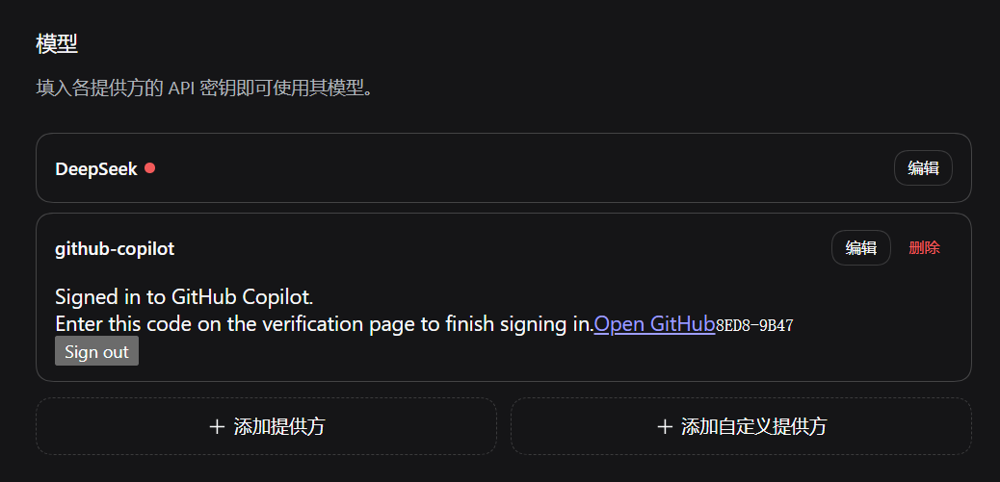

# dsh-github-copilot

[](https://github.com/cloga/dsh-github-copilot/actions/workflows/ci.yml)
[](https://github.com/cloga/dsh-github-copilot/actions/workflows/release.yml)
[](https://github.com/cloga/dsh-github-copilot/releases/latest)
[](./LICENSE)

**English** | [简体中文](./README.zh.md)

A focused DSH companion for GitHub Copilot sign-in, account-aware model profiles, Copilot-specific tool compatibility, and provider-hosted search. It reuses DSH's built-in `@deepseek-ai/dsh-llm-pi-ai`; it is not a second Copilot model adapter or catalog.

## Tested baselines

| DSH surface | Tested source | Models UI |
|---|---|---|
| Controlled Desktop `0.1.1-rc.2` baseline | Controlled Core commit [`a772dbb`](https://github.com/cloga/deepseek-harness/commit/a772dbbde82780bff2b9394427e9f0a24cafa1d5) on `cloga-pi-ai-model-api` | Dedicated **Settings → GitHub Copilot** section |
| DSH `0.1.2-rc.1` | Tag commit [`a66e470`](https://github.com/deepseek-ai/deepseek-harness/commit/a66e4702047846cdaa10c66c9d3df3951f5ea70d) | **Settings → Models** provider card |

The stock rc.2 tag does not resolve per-model `api` entries and is not the tested mixed-protocol baseline. Package peer ranges admit only the two exact DSH releases above. Newer DSH or pi-ai versions require a fresh compatibility review before the range changes.

## Install and sign in

Install the current release into the profile you use (replace `web` when targeting another profile):

```sh
dsh plugin --profile web add https://github.com/cloga/dsh-github-copilot/releases/download/v0.3.0-cloga.15/dsh-github-copilot-0.3.0-cloga.15.tgz
```

Then open the Models UI listed above, find **GitHub Copilot**, select **Sign in**, and complete the GitHub device-code flow. Plugin installation changes the selected profile; activation follows that profile's normal reload/restart policy.

### User authorization flow

1. Open **Settings → Models** and find the `github-copilot` provider card.
2. Select **Sign in with GitHub**. The card changes to **Waiting for GitHub authorization…** and shows an **Open GitHub** link plus a one-time device code.
3. Open the link, sign in to the GitHub account that owns the Copilot entitlement, enter the displayed code, and approve the request. Never paste a GitHub token into DSH.
4. Return to DSH. The card polls automatically; success is shown as **Signed in to GitHub Copilot.** with a **Sign out** button. The one-time URL and code disappear after success.
5. Select a model under the `github-copilot` provider. If no model appears, restart the profile once and see [Migration and troubleshooting](#migration-and-troubleshooting).

The device code is temporary and should be visible only while authorization is in progress. The following screenshots show the affected pre-fix behavior: the full Models page and a close-up where a successful status was incorrectly displayed beside the stale code. Current builds clear that instruction after authorization settles.




### Agent and automation flow

Agents should treat the browser authorization as a human handoff, not as a token-acquisition task:

1. Install the pinned release into the requested profile and restart/reload that profile when required.
2. Direct the user to **Settings → Models → GitHub Copilot → Sign in with GitHub**.
3. Tell the user to open the displayed verification URL and enter the displayed one-time code. Do not ask for, read, copy, log, or persist the user's GitHub token.
4. Wait for the user to complete the browser step. Do not repeatedly start new authorization attempts while one is in flight.
5. Confirm that the card says **Signed in to GitHub Copilot.**, that the device-code notice is gone, and that Copilot models are available.
6. Use **Sign out** only when the user explicitly asks to disconnect the account. It deletes the Copilot credential record but preserves route settings.

GitHub Releases are the authoritative distribution channel. This repository intentionally does not publish to npm. Deployment automation should pin the versioned tarball and verify `SHA256SUMS` from the same Release.

No `copilot2api` process, external gateway, placeholder API key, pasted GitHub token, or separate `dsh-web-search-provider` installation is required.

## What this package owns

- A conditional authorization-service fallback for profiles such as rc.2 that omit Core's service.
- The Models provider-card UI, Client-safe Remote descriptors, and Host authorization controller.
- Strict normalization of pi-ai's provider-owned Copilot OAuth grant.
- Account-aware reconciliation of the Copilot route's `models` and `compat.supportsStrictMode` leaves.
- Direct provider-hosted search through inline agent-loop interception and a Responses-only `ctx.web` provider.

DSH Core continues to own model selection, sandboxing, tools, attachments, and other providers. `@deepseek-ai/dsh-llm-pi-ai` owns the Copilot adapter, catalog, OAuth method and grant format, token exchange, refresh, and normal model transport. Credentials remain Host-only.

## Authorization and route behavior

`llm-pi-ai` registers the OAuth method; the authorization service orchestrates the interaction; this package contributes the UI/Remote controller and route reconciliation. Core supplies authorization on rc.1. On rc.2 profiles that omit it, this package mounts its runtime dependency and reuses any provider already present.

After sign-in and during Host startup, the package intersects the account's `availableModelIds` with the installed pi-ai catalog and materializes each model as `{ id, api }`. A missing profile is created without route-level connection references. For an existing profile, reconciliation intentionally changes only:

- `providers.github-copilot.models`
- `providers.github-copilot.compat.supportsStrictMode`

Every other Copilot field and unrelated provider is preserved, including legacy `baseURL` or `apiKeyEnv` values. Remove those legacy fields explicitly during migration. Sign-out deletes only the `llm-pi-ai/github-copilot` credential record and keeps route settings.

Before a grant is persisted or reused, the Host normalizer rebuilds only pi-ai's documented `type`, `refresh`, `access`, finite `expires`, optional `enterpriseUrl`, and optional deduplicated `availableModelIds` fields into a fresh plain JSON object.

## Hosted search

- **Inline agent-loop path:** supports native-search candidates using OpenAI Responses or Anthropic Messages.
- **`github-copilot-hosted` through `ctx.web.search()`:** supports OpenAI Responses candidates only.
- **Chat Completions models:** remain usable through normal `llm-pi-ai` transport but do not advertise hosted search.

Requests go directly to the credential-resolved HTTPS Copilot endpoint after strict host validation: GitHub-hosted `api.*.githubcopilot.com`, or `copilot-api.<signed-in-enterprise-domain>` for an accepted GitHub Enterprise credential. No external gateway receives the credential.

By default (`probe: true`), search fails closed unless the selected route is `github-copilot`, the account exposes the model, the installed protocol supports native search, and a bounded capability probe succeeds. Setting `probe: false` bypasses only capability proof and trusts the selected native protocol; route, account, protocol, endpoint, and authentication checks remain active. Authentication, HTTP, malformed-body, abort, and network probe failures do not fall back to an external search path.

## Copilot tool compatibility

To prevent observed invalid Copilot tool payloads, the package sets the managed route's `compat.supportsStrictMode` leaf to `false` and applies two schema-only fixes when the selected provider is exactly `github-copilot`: it removes top-level `sandbox_permissions` and `justification` properties, and rewrites Core's multi-action `update_goal` parameters as a discriminated `oneOf`. Each Goal action then advertises only its legal fields: `complete`, `pause`, and `resume` cannot carry edit or blocker fields; `blocked` requires `blocked_reason`; and `edit` alone exposes replacement fields. Execution still uses Core's original Goal tool and service. Non-Copilot prompt assemblies are unchanged.

Copilot sessions that need wider file or command access must select sufficient standing permissions before the call. Installation agents must also follow these payload rules:

- Omit `sandbox_permissions` and `justification` on initial `pwsh` calls.
- Never emit them when approval prompts are disabled or the current mode is already `danger-full-access`.
- Use them only for the single exact-command retry allowed after a real sandbox denial when approval is available and the requested mode is wider.
- Omit the keys entirely rather than sending null, empty, or current-mode values.

The plugin does not rewrite `$DSH_HOME/AGENTS.md`. Installers may merge these rules into user instructions only with explicit user consent.

## Settings

The `github-copilot` settings section controls hosted search only:

| Key | Default | Scope and meaning |
|---|---:|---|
| `enabled` | `true` | Enable both hosted-search surfaces. |
| `providers` | `[]` | Optional route allowlist for both surfaces; empty follows the selected route. |
| `includeSources` | `true` | Request provider citations on the inline path. The `ctx.web` bridge always requests and returns sources. |
| `stripServerTools` | `true` | On the inline path, remove local function variants of provider-hosted search tools. |
| `idleTimeoutMs` | `300000` | Inline stream idle timeout and `ctx.web` request deadline, in milliseconds. |
| `probe` | `true` | Require capability proof on both surfaces; `false` explicitly trusts the native protocol. |
| `probeTimeoutMs` | `30000` | Whole capability-probe deadline, in milliseconds. |

There are no token, API-key, model-catalog, or endpoint settings in this package.

## Migration and troubleshooting

Remove old gateway routes, `COPILOT_GITHUB_TOKEN`-style references, `copilot2api`, and `dsh-web-search-provider` before relying on the managed route.

- **No sign-in control:** confirm the package is installed in the active profile and use the baseline-specific Models UI above.
- **Signed in but no models:** the account must expose at least one model present in the installed pi-ai catalog; the package fails closed instead of enabling the full catalog.
- **Hosted search unavailable:** select the `github-copilot` route, choose an account-available Responses or Anthropic model, and inspect the named probe error. The explicit `ctx.web` provider is Responses-only.
- **Legacy endpoint/key still present:** reconciliation preserves unowned fields by design; remove legacy connection fields manually.

## Package entries and source map

Public exports are `.`, `./client`, `./remote`, `./deployment-baseline.json`, and `./package.json`.

- `src/index.ts`: authorization bootstrap, dependency-gated Host composition, settings, inline interception, and `ctx.web` registration.
- `src/authorization-controller.ts`: Host authorization and path-level route reconciliation.
- `src/copilot-grant.ts`, `src/copilot-auth.ts`: grant normalization and Host credential lifecycle.
- `src/client.ts`, `src/remote.ts`: Models UI and Client-safe Remote contract.
- `src/current-provider.ts`, `src/plan.ts`, `src/probe.ts`: selected-route projection, candidate planning, and capability proof.
- `src/wire.ts`, `src/wire-anthropic.ts`, `src/traditional-search.ts`: hosted-search transports.
- `deployment-baseline.json`: declared machine-readable compatibility/capability evidence inventory; `scripts/verify-deployment-baseline.mjs` checks its source and test markers for drift.
- `lib/`: generated release output; never edit it directly.

## Build and verify

```sh
pnpm install --frozen-lockfile
pnpm verify
pnpm pack --pack-destination artifacts
```

`pnpm verify` runs typechecking, deployment-baseline checks, build, all tests, and package-export smoke checks. CI additionally verifies the exact controlled rc.2 and rc.1 upstream sources on Windows and Linux.

## Release and checksum verification

`package.json` is private to prevent registry publication. A release tag must equal `v${package.json.version}`. The Release workflow performs the frozen install and complete verification gate, packs the tarball, writes `SHA256SUMS`, and creates the GitHub Release only after every preceding step succeeds.

```sh
curl -LO https://github.com/cloga/dsh-github-copilot/releases/download/v0.3.0-cloga.15/dsh-github-copilot-0.3.0-cloga.15.tgz
curl -LO https://github.com/cloga/dsh-github-copilot/releases/download/v0.3.0-cloga.15/SHA256SUMS
sha256sum --check SHA256SUMS
```

PowerShell can verify the same two downloaded files with:

```powershell
$expected = (Get-Content .\SHA256SUMS).Split()[0]
$actual = (Get-FileHash .\dsh-github-copilot-0.3.0-cloga.15.tgz -Algorithm SHA256).Hash.ToLowerInvariant()
if ($actual -cne $expected) { throw 'Release checksum mismatch' }
```

The checksum detects download corruption or asset drift; repository controls and the protected Release workflow establish publisher provenance. Never move or reuse a release tag. Increment the package and deployment-baseline versions together for every release. See [CONTRIBUTING.md](./CONTRIBUTING.md) for the change workflow and [SECURITY.md](./SECURITY.md) for private vulnerability reporting.
