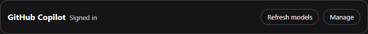

# dsh-github-copilot

[](https://github.com/cloga/dsh-github-copilot/actions/workflows/ci.yml)
[](https://github.com/cloga/dsh-github-copilot/actions/workflows/release.yml)
[](https://github.com/cloga/dsh-github-copilot/releases/latest)
[](./LICENSE)

**English** | [简体中文](./README.zh.md)

A focused DSH companion for GitHub Copilot sign-in, account-aware model profiles, Copilot-specific tool compatibility, and provider-hosted search. It reuses DSH's built-in `@deepseek-ai/dsh-llm-pi-ai`; it is not a second Copilot model adapter or catalog.

## Tested baselines

| DSH surface | Tested source | Models UI |
|---|---|---|
| Controlled Desktop `0.1.1-rc.2` baseline | Controlled Core commit [`a772dbb`](https://github.com/cloga/deepseek-harness/commit/a772dbbde82780bff2b9394427e9f0a24cafa1d5) on `cloga-pi-ai-model-api` | Dedicated **Settings → GitHub Copilot** section |
| DSH `0.1.2-rc.1` | Tag commit [`a66e470`](https://github.com/deepseek-ai/deepseek-harness/commit/a66e4702047846cdaa10c66c9d3df3951f5ea70d) | **Settings → Models** provider card |
| DSH `0.1.3-alpha.1` | Tag commit [`d347e70`](https://github.com/deepseek-ai/deepseek-harness/commit/d347e703908d0406b7a7ef80e3a0e594d86b2215) | **Settings → Models** provider card |

The table retains historical source pins; it does not imply the new account-model route has been verified on every baseline. Its current synthetic transport tests use the **published rc.1 adapter with pi 0.85.1**. The controlled rc.2 pin is historical regression evidence only. Alpha.1 has a source release but no standalone npm artifacts; CI therefore exercises its unchanged tagged source through an isolated test resolver, without building or patching Core. That runtime check must pass before claiming alpha.1 compatibility. Stock Core model-entry `api` support is not a prerequisite for the plugin-owned route. Package peer ranges are admission constraints, not live compatibility proof. No Core patch is installed by this plugin.

## Install and sign in

The commands below target the package version `0.4.0-alpha.4`. Versioned URLs describe the intended release artifacts, not proof that publication or local activation has completed; use them only once that Release and its checksums are available. Install into the profile you use (replace `web` when targeting another profile):

```sh
dsh plugin --profile web add https://github.com/cloga/dsh-github-copilot/releases/download/v0.4.0-alpha.4/dsh-github-copilot-0.4.0-alpha.4.tgz
```

Then open the Models UI listed above, find **GitHub Copilot**, select **Sign in**, and complete the GitHub device-code flow. Plugin installation changes the selected profile; activation follows that profile's normal reload/restart policy.

### User authorization flow

1. Open **Settings → Models** and find the compact **GitHub Copilot** account row. It does not require adding a native provider profile.
2. Select **Sign in with GitHub**. The authorization area expands automatically with a prominent one-time code, **Open GitHub verification page**, **Copy code**, and **Cancel sign-in**. No extra **Manage** click is needed.
3. Copy the code, open the verification link, and complete authorization in your own GitHub browser session. Copy success/failure is announced accessibly; manual copying remains available. Never paste a GitHub token into DSH.
4. DSH polls only while authorization is in flight. On success, the code, verification link and copy feedback disappear; the automatic authorization area closes and the compact row shows **Signed in**, **Refresh models**, and **Manage**. Manually opened management details stay open. Cancelling clears the old code; failures remain visible rather than disappearing into a collapsed area.
5. **Refresh models** explicitly updates account metadata without changing your current/default model. **Manage** reveals model details, sign-out and compatibility guidance; simply opening it does not discover models. Select an accepted model under **GitHub Copilot** in the model picker (stable route ID `github-copilot-preview`). See [Migration and troubleshooting](#migration-and-troubleshooting) for rejected models or refresh errors.

The unified account card lives independently of a native provider row; do not use **Add provider** merely to sign in. If it is missing, verify the active profile and loaded Host/Client version. The animation shows the unified **Sign in → Copy code → Copied → Signed in → Refresh models → Metadata ready** flow. Actual authorization on GitHub is a separate user step and is not recorded.


These previews render this revision's compact account component in an isolated, network-disabled browser fixture. They are not proof that the planned package version is already published or installed. Authorization and discovery responses are synthetic; `ABCD-EFGH` is not a usable code. No real sign-in, sign-out, model refresh, credential change, or route migration was performed for recording, and no production cookies or browser storage were reused. The UI states demonstrate the interaction, not live authorization or model availability.

The unified card keeps the one-time code prominent during authorization:


After authorization completes, the automatic code area disappears. The default row keeps only **GitHub Copilot**, status, **Refresh models**, and **Manage**. **Sign out**, model lists and compatibility guidance live inside **Manage**; login alone does not discover models, and refresh failures remain visible even when management is collapsed.



### Agent and automation flow

Agents should treat the browser authorization as a human handoff, not as a token-acquisition task:

1. Install the pinned release into the requested profile and restart/reload that profile when required.
2. Direct the user to **Settings → Models → GitHub Copilot → Sign in with GitHub**.
3. Tell the user to open the displayed verification URL and enter the displayed one-time code. Do not ask for, read, copy, log, or persist the user's GitHub token.
4. Wait for the user to complete the browser step. Do not repeatedly start new authorization attempts while one is in flight.
5. Confirm **Signed in** and that the device-code notice is gone; then explicitly refresh account models and inspect metadata before asking the user to choose one. Login, discovery and successful model calls are separate evidence.
6. Use **Sign out** only when the user explicitly asks to disconnect the account. It deletes the Copilot credential record but preserves route settings.

GitHub Releases are the authoritative distribution channel. This repository intentionally does not publish to npm. Deployment automation should pin the versioned tarball and verify `SHA256SUMS` from the same Release.

No `copilot2api` process, external gateway, placeholder API key, pasted GitHub token, or separate `dsh-web-search-provider` installation is required.

## What this package owns

- A conditional authorization-service fallback for profiles such as rc.2 that omit Core's service.
- One unified Models account card, independent of native provider rows, Client-safe Remote descriptors, and Host authorization controller.
- Strict normalization of pi-ai's provider-owned Copilot OAuth grant.
- Preservation of intentional canonical-route absence, compatibility repair of existing legacy profiles, and restoration of verified old overrides. It never automatically removes user profiles or replaces Core's model list from another pi catalog.
- A data-driven account-model route using pi `0.85.1`, authenticated Copilot metadata, and the published native DSH adapter. New model IDs do not require a model-specific code patch when their advertised protocol and capabilities are supported.
- Direct provider-hosted search through inline agent-loop interception and a Responses-only `ctx.web` provider.

DSH Core continues to own model selection, sandboxing, tools, attachments, and other providers. `@deepseek-ai/dsh-llm-pi-ai` owns the Copilot adapter, catalog, OAuth method and grant format, token exchange, refresh, and normal model transport. Credentials remain Host-only.

## Authorization and route behavior

`llm-pi-ai` registers the OAuth method; the authorization service orchestrates the interaction; this package contributes the UI/Remote controller and route reconciliation. Core supplies authorization on rc.1. On rc.2 profiles that omit it, this package mounts its runtime dependency and reuses any provider already present.

New installations use one account-discovered route displayed as **GitHub Copilot**, with the unchanged actual ID `github-copilot-preview`. The unified account card/footer supplies login and **Refresh models** independently of native provider rows. Refresh explicitly fetches the signed-in account's Copilot `/models` metadata before you select a model; it does not change a session, default or history automatically.

An existing Core-owned `github-copilot` profile is preserved, so upgrades can still show two real routes until the user completes [explicit single-route migration](./docs/single-route-migration.md). This is not a UI filter or facade. After actual removal of the reviewed legacy profile, both the composer picker and `/model` receive only the managed Copilot group. Old conversations remain stored unchanged, but a paused conversation still selecting the removed canonical route needs an explicit managed model selection when resumed.

The managed route selects Responses, Chat Completions or Anthropic Messages from advertised `supported_endpoints`, not model names or a per-model allowlist. An existing pi protocol is retained only if the server also advertises it. New IDs with complete supported metadata can therefore work without another plugin release. Missing endpoints, disabled policy, unsupported protocols or malformed limits produce explicit diagnostics rather than guesses. Updating pi or seeing a model ID in its catalog does not itself prove the protocol is correct.

Discovery is bounded and cached for five minutes. Attach, status reads and credential notifications do not start it automatically; an explicit refresh or an actual model preparation can perform discovery and native OAuth refresh. Each request is tied to the account, token, permission snapshot and catalog generation. Account changes, revoked permissions, expired metadata and disposal invalidate old requests. A newly advertised, server-enabled model may work even before an older grant's cached ID list includes it; this does not rewrite the grant.

**Plugin-only development boundary:** fixes in this project must use existing published public APIs and remain in the plugin. Do not patch Core source, installed binaries, `node_modules`, private runtime registries or shared upstream catalogs; do not make a new Core export or upstream Core PR a delivery prerequisite. Read-only inspection and isolated verification against unchanged pinned Core artifacts are allowed. If a stock API cannot support a requested feature, state the limitation and use a tested plugin-local alternative rather than changing Core. The authoritative policy and its machine checks are documented in [AGENTS.md](./AGENTS.md#plugin-only-implementation-boundary).

Keep `llm-pi-ai` mounted: its OAuth method and the unique Host-only `llm-pi-ai/github-copilot` credential remain the authentication owner even without a canonical model profile. Do not sign out, remove the authorization plugin or copy credentials to hide a route. Model metadata from another dependency copy is not proof that actual Core supports that model or protocol.

The plugin does not install a global Responses override or recreate a missing canonical profile on login, startup or token refresh. Existing canonical profiles retain their models, protocol, headers and custom fields; normal legacy reconciliation changes only `compat.supportsStrictMode: false`. Removing such a profile requires explicit migration, not an automatic upgrade side effect. The managed route obtains supported protocols from account metadata and does not fall back to a static catalog when discovery fails.

Previously installed plugin overrides are restored only through a verified ownership journal, to the recorded original `api`/`models` values. Owned public headers are removed only if their values still match. User edits, ambiguous legacy markers and interrupted uncommitted writes remain conflicts rather than being forcibly adopted. Restoring an absent or empty model list returns Core to its default catalog; it does not mean an empty set of models.

Temporary ownership uses a bounded version-2 journal: raw `api`/`models` preimage and postimage, prepared restoration target, namespace revision and process epoch. Only fixed public Copilot headers can enter the journal; arbitrary header values, credential payloads and custom model extras are never copied into it. Every write uses the namespace revision; current owned fields must still match the recorded values. Conflicts retain the journal and user edits instead of guessing ownership. Deleting a created profile additionally requires its complete raw shape to be plugin-owned, with no base profile, user additions or set secrets. Normal reconciliation merges actual raw user extras only, not schema defaults. These checks are conservative recovery safeguards, not an atomic transaction across settings namespaces and credential storage.

**Upgrade boundary:** older backups without postimages/epoch are reported as `conflict`, not automatically adopted. Review the existing route and backup before explicitly migrating or removing the marker; do not reconnect or delete it to force ownership. A later invocation never replays a prepared but uncommitted activation/restoration automatically: Core revision counters reset on namespace re-registration as well as restart, and there is no public durable registration identity. Even matching recorded epoch/revision is not enough to prove ownership across that boundary. Steady owned postimages can begin a fresh restoration, and already-restored targets can clear their journal without replaying writes. An existing recorded restoration target that differs from the original preimage remains a conflict for explicit review; a new account model set never authorizes overwriting that evidence. Remove legacy connection fields explicitly during migration. Sign-out itself still deletes only the `llm-pi-ai/github-copilot` credential record and keeps route settings.

### Read-only status and explicit repair

`githubCopilot.status()` and Host `describeGitHubCopilotProviderProfile()` only read stored state and plan legacy canonical changes. They do not write settings, refresh OAuth or test the network. Status separates configured authentication from legacy route states `ready`, `needs-repair`, `not-configured`, `conflict` and `error`. With valid login, `route: not-configured` normally means the optional canonical profile is absent: it is not a login error or a repair request, and it does not prove managed discovery is ready. `ready` only means the inspected canonical configuration needs no repair. Discovery and successful model/search calls remain separate evidence.

Use **Repair model configuration** (Remote `githubCopilot.reconcile()`) for an explicit, revision-checked repair of an existing legacy profile or verified journal. It does not fetch a model list, create an absent profile, or force conflicts. Successful login, startup and auth-refresh reconciliation also preserve absence. Browser status polling is read-only; deploy matching Host and Client bundles.

Before a grant is persisted or reused, the Host normalizer rebuilds only pi-ai's documented `type`, `refresh`, `access`, finite `expires`, optional `enterpriseUrl`, and optional deduplicated `availableModelIds` fields into a fresh plain JSON object.

## Hosted search

- **Managed-route conversations:** `github-copilot-preview` uses the native adapter, not the custom inline wire; this preserves account evidence, replay and attachment handling.
- **`github-copilot-hosted` through `ctx.web.search()`:** supports account-authorized OpenAI Responses candidates, including the single managed route. Ordinary chat success is not search capability proof.
- **Legacy canonical inline agent-loop path:** eligible `github-copilot` requests support Responses or Anthropic Messages native-search candidates only while that legacy route remains configured.
- **Chat Completions models:** remain usable through normal native transport but do not advertise hosted search.

Installing this package registers `github-copilot-hosted` but deliberately does not replace the profile-wide `web.searchProvider`. This keeps mixed-provider profiles unchanged. A Copilot-focused profile can opt in by adding the following row to `$DSH_HOME/profiles/<profile>/cordis.patch.yml` (merge it into the existing top-level patch list):

```yaml
# Optional: route the Core web_search Tool through GitHub Copilot.
- id: web
  config:
    searchProvider: github-copilot-hosted
    fetchProvider: http
```

A patch row replaces the target row's complete `config`, so keep `fetchProvider: http` for the default HTTP fetcher (or retain your explicitly configured fetch provider). If a `web` override already exists, update that row rather than replacing the whole patch file; keep unrelated configuration. Restart that profile after editing. This is a global profile choice, not model-aware routing: on a non-Copilot or non-Responses route, `web_search` reports the configured Copilot provider unavailable and does not fall back to DeepSeek. To undo it, remove only the row added for this opt-in or restore your previous `web` configuration.

An explicit `web.searchProvider` takes precedence over `DSH_WEB_SEARCH_PROVIDER`. Setting that environment variable alone will not override a bundle that already selects `deepseek-official`. A `DEEPSEEK_API_KEY` search error therefore means the direct search Tool still selected DeepSeek; Copilot sign-in does not configure DeepSeek credentials. The Copilot search path uses its own OAuth grant and does not require that key.

Requests go directly to the credential-resolved HTTPS Copilot endpoint after strict host validation: GitHub-hosted `api.*.githubcopilot.com`, or `copilot-api.<signed-in-enterprise-domain>` for an accepted GitHub Enterprise credential. No external gateway receives the credential.

By default (`probe: true`), search fails closed unless the selected route is canonical `github-copilot` or the plugin-owned `github-copilot-preview`, the account authorizes the model, its verified protocol supports native search, and a bounded capability probe succeeds. Managed-model conversations always use their native adapter; independent Responses `ctx.web` search uses account-bound authorization without the old static-catalog ID restriction. Setting `probe: false` bypasses only capability proof and trusts the selected native protocol; route, account, protocol, endpoint, and authentication checks remain active. Authentication, HTTP, malformed-body, abort, and network probe failures do not fall back to an external search path. Requests containing any Core file block—including files nested in tool-result content—also fail closed to `next()`, preserving Core's file projection instead of letting the hosted-search serializer drop that context.

Search proof is lazy: attach, settings updates and `credentials/record-updated` for `llm-pi-ai/github-copilot` only invalidate cached plans, without starting network work. The next actual eligible request proves capability again; unrelated credentials are ignored and event bursts do not trigger repeated eager probes. In-flight proofs are cancelled on invalidation/disposal. If credentials change during proof or final auth resolution, the current request fails closed rather than applying account A's proof to account B. Submit a new request after the update; there is no automatic retry loop or implicit `probe: false` fallback.

## Reasoning summaries and empty Think disclosures

On the eligible custom Responses path, an explicit request reasoning effort overrides the provider profile default. The companion validates it against the selected model's declared/native efforts, maps its wire value, and requests `summary: "auto"`, matching the native pi-ai path. No effort selection leaves provider defaults unchanged; Core's `off` omission is preserved rather than represented as a guaranteed server-side disable. Unsupported or missing model metadata fails with a named error before the custom model request; the separate capability probe retains its existing lifecycle.

The Responses parser preserves public `reasoning_summary_text` and `reasoning_text` events, final-only summaries, and interleaved parts without repeating delta text from completion snapshots. Empty or encrypted-only items do not become fabricated explanations. Some Copilot Responses requests still return encrypted reasoning without public text: [summaries are optional](https://developers.openai.com/api/docs/guides/reasoning), and requesting one does not guarantee it. The companion never decrypts or invents reasoning.

Requests whose assistant history contains reasoning blocks or opaque `replayState` bypass the custom wire through Core **before probing**. A public summary must not be reconstructed as a raw `reasoning_text` input item, and encrypted replay belongs to Core. This deliberately limits inline search on such histories; the separate Responses-only `ctx.web` provider remains available under its usual route/probe gates.

On the guarded Chat rendering contract, the Client hides completed, empty or whitespace-only reasoning disclosures for replies whose own recorded provider is `github-copilot` or `github-copilot-preview`, for any valid model ID. It delegates the remaining view to DSH's native renderer. Nonempty summaries, answers, tools, images and actions remain unchanged. Running or interrupted steps, unknown provenance, and non-Copilot replies retain their native rendering; selecting a different model later does not reclassify historical replies. Because this runs on the rendered view rather than the search transport, it also covers native/image request paths and loaded history when the necessary provenance is present.

Filtering changes only temporary render props. Durable messages, encrypted signatures, replay-state block indexes and token usage are not rewritten, so future requests retain the original reasoning context. There is no DOM polling or whole-page observer. Removing the plugin withdraws the contribution and restores native rendering.

This optional integration uses the public `conversation.chat.node` keyed slot and `uiConversation` location data. Its guard checks the current plain memo renderer named `AssistantNodeView`; renamed/minified future renderers are left alone. This is a compatibility check, not module-ownership or security proof: a deliberate replacement with identical naming and metadata cannot be distinguished through this registry. It does not block authorization on older Cores. Missing or incompatible extension contracts, or a competing assistant renderer, leave native output unchanged with a named compatibility diagnostic. The new display behavior is not a claim of live GPT-6 transport success; unsupported Core versions may still show empty Think rows. It does not change the `github-copilot.enabled` setting, which controls hosted search only.

### Capability warnings and adapter limits

- `REASONING_EFFORTS_UNSUPPORTED` means some advertised reasoning labels cannot be expressed faithfully by the selected native SDK protocol. They are not guessed, and ordinary requests remain available. Explicit unsupported efforts—including an unadvertised `off`—are rejected rather than silently treated as defaults.
- `INPUT_LIMIT_NOT_ENFORCED_BY_CORE` means the provider advertises a separate prompt limit smaller than its combined context. The plugin retains both values, but the published Core model-info interface exposes only combined context; it does not automatically enforce the independent input limit. Oversized requests can still be rejected by the provider.
- The Core-facing integration uses the published adapter's normal `streamSimple` path. Its advanced `stream` entry explicitly rejects incompatible protocol-specific SDK client objects; this does not disable normal conversation streaming.
- Unknown pricing is represented as unpriced metadata, not a claim that a model is free. Public summaries remain optional provider output.

## Copilot tool compatibility

To prevent observed invalid Copilot tool payloads, the package sets the managed route's `compat.supportsStrictMode` leaf to `false` and applies two schema-only fixes when the selected provider is canonical `github-copilot` or the plugin-owned account route `github-copilot-preview`: it removes top-level `sandbox_permissions` and `justification` properties, and rewrites Core's multi-action `update_goal` parameters as a discriminated `oneOf`. Each Goal action then advertises only its legal fields: `complete`, `pause`, and `resume` cannot carry edit or blocker fields; `blocked` requires `blocked_reason`; and `edit` alone exposes replacement fields. Execution still uses Core's original Goal tool and service. Non-Copilot prompt assemblies are unchanged.

Copilot sessions that need wider file or command access must select sufficient standing permissions before the call. Installation agents must also follow these payload rules:

- Omit `sandbox_permissions` and `justification` on initial `pwsh` calls.
- Never emit them when approval prompts are disabled or the current mode is already `danger-full-access`.
- Use them only for the single exact-command retry allowed after a real sandbox denial when approval is available and the requested mode is wider.
- Omit the keys entirely rather than sending null, empty, or current-mode values.

The plugin does not rewrite `$DSH_HOME/AGENTS.md`. Installers may merge these rules into user instructions only with explicit user consent.

## Settings

The `github-copilot` settings section controls hosted search only:

| Key | Default | Scope and meaning |
|---|---:|---|
| `enabled` | `true` | Enable both hosted-search surfaces. |
| `providers` | `[]` | Optional route allowlist for both surfaces; empty follows the selected route. |
| `includeSources` | `true` | Request provider citations on the inline path. The `ctx.web` bridge always requests and returns sources. |
| `stripServerTools` | `true` | On the inline path, remove local function variants of provider-hosted search tools. |
| `idleTimeoutMs` | `300000` | Inline stream idle timeout and `ctx.web` request deadline, in milliseconds. |
| `probe` | `true` | Require capability proof on both surfaces; `false` explicitly trusts the native protocol. |
| `probeTimeoutMs` | `30000` | Whole capability-probe deadline, in milliseconds. |

There are no token, API-key, model-catalog, or endpoint settings in this package.

## Migration and troubleshooting

Existing installations must follow the [single-route migration guide](./docs/single-route-migration.md) before removing a native profile. The plugin does not migrate defaults, presets, active sessions or history for you. Old gateway routes and `COPILOT_GITHUB_TOKEN`-style references are not required; review them separately rather than deleting unrelated user configuration.

- **No sign-in control:** confirm the package is loaded in the active profile and use the baseline-specific UI above. Do not add a native provider just to reveal login.
- **Two Copilot groups after upgrade:** a legacy canonical profile is still configured; it is preserved deliberately. After explicit migration/removal, both composer and `/model` list only the managed group. There is no display-only alias masking a second route.
- **Signed in but a new model is missing:** click **Refresh models**, then inspect accepted/rejected models for the `github-copilot-preview` route displayed as **GitHub Copilot**. Unsupported endpoints or incomplete metadata produce diagnostics, not static-catalog fallback. Do not repeat login or disable validation.
- **Canonical route says `not-configured`:** with configured login this is normal managed-only mode; inspect account discovery separately rather than creating a native profile.
- **Delete dialog stays on “Deleting…”:** this update does not prove that hang fixed. Do not repeatedly delete; after an authorized Host stop, inspect persisted settings and follow the migration guide before deciding whether any removal is still needed.
- **No Think text:** the provider may omit public summaries, but nonempty summaries must survive the Responses parser. Check selected effort and named errors. Empty disclosures are hidden only after completion; encrypted replay is never displayed. Reasoning/replay-bearing histories use native Core transport.
- **Hosted search unavailable:** for managed-only use, select an accepted Responses model under **GitHub Copilot** and inspect discovery/probe errors for `ctx.web` search. The custom inline path is legacy-canonical only; normal managed chat success does not prove search support.
- **Legacy endpoint/key still present:** reconciliation preserves unowned fields by design. Review explicit migration; never force-remove an ownership marker.

## Package entries and source map

Public exports are `.`, `./client`, `./remote`, `./deployment-baseline.json`, and `./package.json`.

- `src/index.ts`: authorization bootstrap, dependency-gated Host composition, settings, inline interception, and `ctx.web` registration.
- `src/authorization-controller.ts`: Host authorization and path-level route reconciliation.
- `src/copilot-grant.ts`, `src/copilot-auth.ts`: grant normalization and Host credential lifecycle.
- `src/client.ts`, `src/remote.ts`: Models UI and Client-safe Remote contract.
- `src/account-model-catalog.ts`, `src/account-model-source.ts`, `src/account-model-auth.ts`: bounded account discovery, endpoint/capability normalization and native OAuth binding.
- `src/preview-route.ts`, `src/preview-provider.ts`, `src/pi-provider-bridge.ts`: data-driven account models and the public native adapter/SDK boundary.
- `src/current-provider.ts`, `src/plan.ts`, `src/probe.ts`: owned route facts, candidate planning and capability proof.
- `src/temporary-models.ts`, `src/route-ownership.ts`: recognition and conservative restoration of historical configuration writes; not a new-model routing table.
- `src/model-protocol.ts`: public local facts with explicit ownership limits; no unshipped Core service dependency.
- `src/responses-reasoning.ts`, `src/responses-reasoning-text.ts`: selected-model effort mapping and public summary assembly.
- `src/wire.ts`, `src/wire-anthropic.ts`, `src/traditional-search.ts`: hosted-search transports.
- `deployment-baseline.json`: declared machine-readable compatibility/capability evidence inventory; `scripts/verify-deployment-baseline.mjs` checks its source and test markers for drift.
- `lib/`: generated release output; never edit it directly.

## Build and verify

```sh
pnpm install --frozen-lockfile
pnpm verify
pnpm pack --pack-destination artifacts
```

Use Node 24 LTS for development and the pinned pnpm version; runtime dependencies require Node >=22.19.0. `pnpm verify` runs the Agent contract check, source and local test typechecking, baseline markers, clean build, Vitest and Node tooling tests, and a real built Host import plus Client/Remote smoke. After packing, run `pnpm verify:tarball -- artifacts/dsh-github-copilot-<package-version>.tgz` to verify archive exports, media, allowed contents and equality to that build. CI checks the exact controlled rc.2, rc.1 and alpha.1 Core sources/config fixtures on Windows and Linux; release publication depends on that full matrix.

For the optional reasoning UI integration, `pnpm verify:reasoning-ui -- <Core checkout>` runs a synthetic native-renderer, Slot registry and history-assembly fixture against a clean pinned rc.1 or alpha.1 checkout with its Chat dependencies installed. It exclusively creates one temporary test file and removes it only if unchanged. This is local integration/static-render evidence, not a live browser or Copilot API test; CI runs it on both supported Chat baselines.

### Agent-driven development

From a source checkout, use these read-only entrypoints (no dependencies needed for discovery):

```sh
node scripts/agent.mjs describe --json
node scripts/agent.mjs doctor --json
node scripts/agent.mjs plan models --json
node scripts/agent.mjs attribution "DeepSeek Harness (DSH)"
```

`agent-contract.json` maps authorization, models, search, client, compatibility, tooling and release tasks to owning files and tests. Plans return unexecuted argument arrays, including the exact package-version archive path. Doctor checks repository prerequisites only: exit 0 means preflight passed, 1 means missing prerequisites, 2 means invalid input/metadata. For clean machine-readable output prefer the direct `node` command rather than parsing pnpm progress logs.

Attribution follows the actual tool: `Assisted-by: DeepSeek Harness (DSH)` for DSH-assisted changes, not a Copilot App co-author inferred from the model provider. Keep the human Git author and reserve `Co-authored-by` for verified collaborators. Merge, profile install, sign-out and worktree checkout require explicit approval. Important updates include post-merge release follow-through under the policy below; they do not require another release prompt.

Evidence is layered: package presence/import and passing synthetic tests do not prove live DSH activation, account entitlement, model transport or hosted search. Authorization `status()` is read-only; explicit reconciliation/startup may persist configuration, while capability probes run only on actual eligible requests. None of these reports implies live transport success without a real request. Session model overrides that differ from the default plan now keep Core transport instead of using the default model. See the [readiness audit](./docs/agent-readiness.md) for evidence and remaining limitations.

## Important-update release delivery

Important user-requested features, behavior fixes, compatibility fixes, and security or stability fixes include publication after an authorized merge and green required CI. The agent must continue version preparation, the protected tag/Release workflow and asset verification without waiting for a second request to release. Plan version alignment in the implementation PR where practical; preserve the prerelease channel unless promotion is requested.

An explicit code-only/review-only/do-not-release instruction takes precedence. Documentation-only and internal-only changes do not trigger a release by default. Merge approval is still required, including for a separate version PR; profile installation and session-interrupting restarts remain separate. This is agent delivery policy, not an unconditional publish-on-merge CI trigger.

Report the published Release URL, version, tag/commit and verified asset SHA-256 before calling release delivery complete. If publication is blocked, report the concrete CI/permission/network blocker and pending step rather than treating a merged PR or local build as a release. Full rules are in [AGENTS.md](./AGENTS.md#important-update-release-delivery).

## Release and checksum verification

`package.json` is private to prevent registry publication. A release tag must equal `v${package.json.version}`. Versions use standard SemVer prerelease labels (`alpha`, `beta`, or `rc`); the historical `cloga` suffix identified downstream fork builds and is no longer used for new versions. The Release workflow performs the frozen install and complete verification gate, packs the tarball, writes `SHA256SUMS`, marks prerelease versions accordingly, and creates the GitHub Release only after every preceding step succeeds.

```sh
curl -LO https://github.com/cloga/dsh-github-copilot/releases/download/v0.4.0-alpha.4/dsh-github-copilot-0.4.0-alpha.4.tgz
curl -LO https://github.com/cloga/dsh-github-copilot/releases/download/v0.4.0-alpha.4/SHA256SUMS
sha256sum --check SHA256SUMS
```

PowerShell can verify the same two downloaded files with:

```powershell
$expected = (Get-Content .\SHA256SUMS).Split()[0]
$actual = (Get-FileHash .\dsh-github-copilot-0.4.0-alpha.4.tgz -Algorithm SHA256).Hash.ToLowerInvariant()
if ($actual -cne $expected) { throw 'Release checksum mismatch' }
```

The checksum detects download corruption or asset drift; repository controls and the protected Release workflow establish publisher provenance. Never move or reuse a release tag. Increment the package and deployment-baseline versions together for every release. See [CONTRIBUTING.md](./CONTRIBUTING.md) for the change workflow and [SECURITY.md](./SECURITY.md) for private vulnerability reporting.
