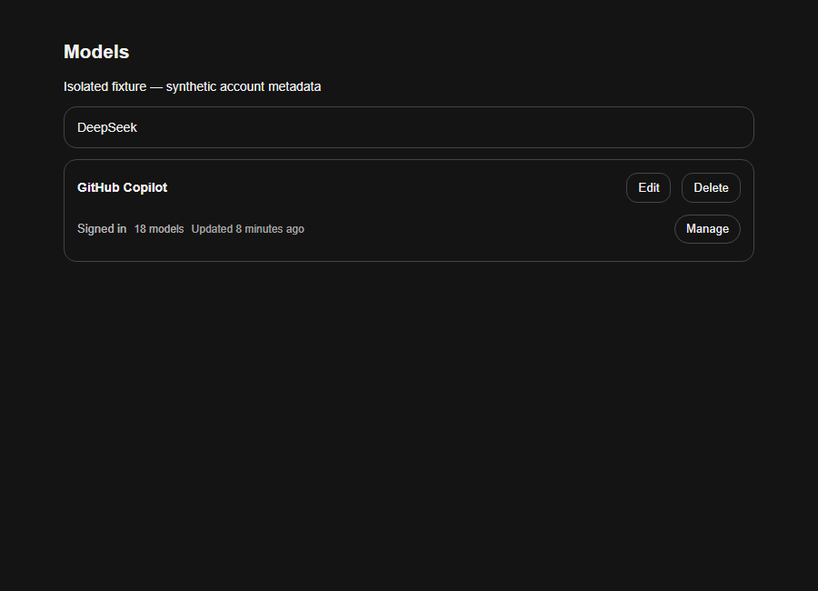
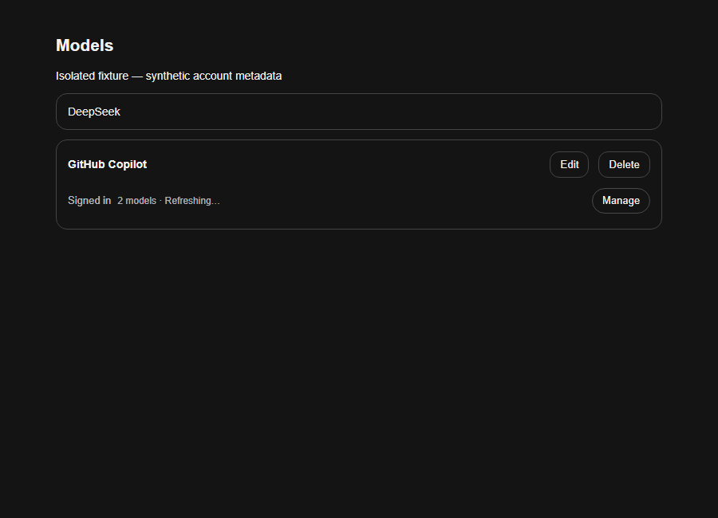
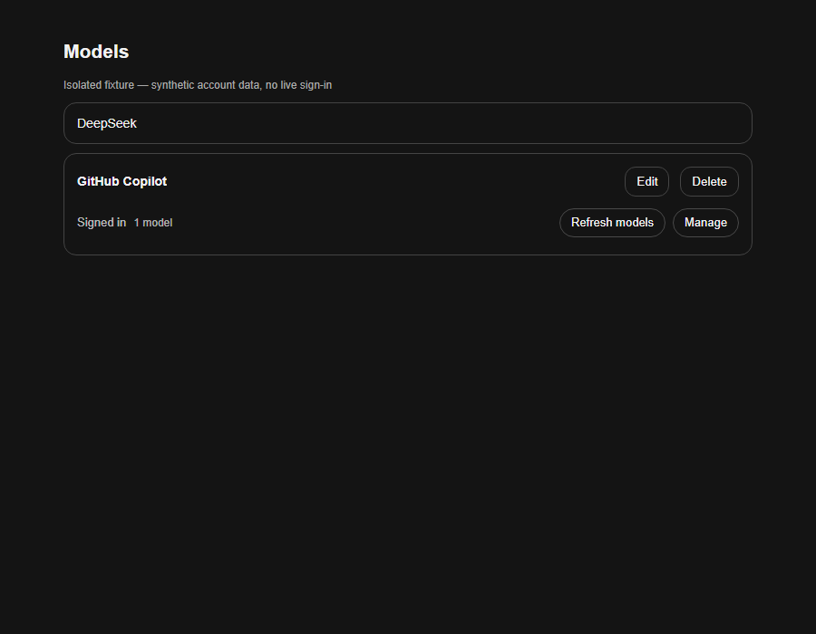
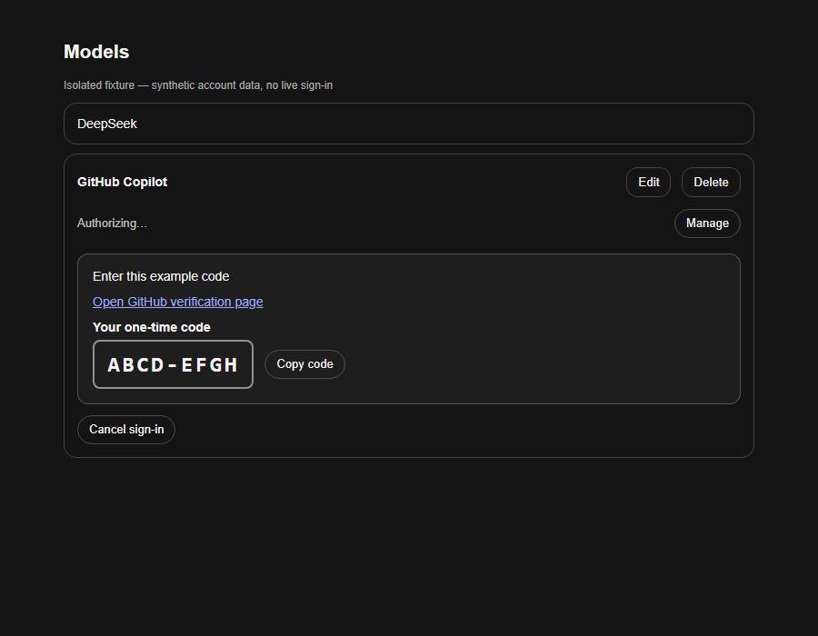

# dsh-github-copilot

[](https://github.com/cloga/dsh-github-copilot/actions/workflows/ci.yml)
[](https://github.com/cloga/dsh-github-copilot/actions/workflows/release.yml)
[](https://github.com/cloga/dsh-github-copilot/releases/latest)
[](./LICENSE)

[English](./README.md) | **简体中文**

一个聚焦 GitHub Copilot 登录、通用账号模型发现、Copilot 专用 Tool 兼容与供应方托管搜索的 DSH companion。插件根据供应方返回的端点和能力元数据组装模型，复用公开的 `@deepseek-ai/dsh-llm-pi-ai` adapter 与 pi-ai SDK，不另写一套通用传输／序列化器，也不维护需要逐个添加新模型 ID 的静态目录。

> 下文自动维护账号模型元数据与 provider 集成控件描述目标版本 `0.4.0-alpha.21`；这不代表已有的两条真实路由被合并或移除。版本化 URL 不表示 Release 已发布或本机已加载；仅在该 Release 与校验和可用后使用安装命令。源码、发布制品、已安装版本和实际加载运行时需分别确认，本地升级和中断会话的重启仍需用户批准。

## 已测试基线

| DSH 表面 | 已测试源码 | Models UI |
|---|---|---|
| 受控 Desktop `0.1.1-rc.2` 基线 | `cloga-pi-ai-model-api` 上的受控 Core commit [`a772dbb`](https://github.com/cloga/deepseek-harness/commit/a772dbbde82780bff2b9394427e9f0a24cafa1d5) | 独立的 **Settings → GitHub Copilot** section |
| DSH `0.1.2-rc.1` | Tag commit [`a66e470`](https://github.com/deepseek-ai/deepseek-harness/commit/a66e4702047846cdaa10c66c9d3df3951f5ea70d) | **Settings → Models** provider card |
| DSH `0.1.3-alpha.1` | Tag commit [`d347e70`](https://github.com/deepseek-ai/deepseek-harness/commit/d347e703908d0406b7a7ef80e3a0e594d86b2215) | **Settings → Models** provider card |
| 官方 DSH `0.1.5-alpha.1` | Tag commit [`5dda764`](https://github.com/deepseek-ai/deepseek-harness/commit/5dda764ed3aa172535a7967b06ff95d9cbfe536a) | **Settings → Models** provider card |
| 官方 DSH `0.1.5-alpha.2` | Tag commit [`b2e3b2a`](https://github.com/deepseek-ai/deepseek-harness/commit/b2e3b2a0125854567a4a5fcba75782e42fe84901) | **Settings → Models** provider card |
| 官方 DSH `0.1.5-rc.1` | Tag commit [`183f08e`](https://github.com/deepseek-ai/deepseek-harness/commit/183f08e9c6dde7e36cd2318eaee70b0da08fb35e) | **Settings → Models** provider card |
| 官方 DSH `0.1.5-rc.2` | Tag commit [`fb2c4b9`](https://github.com/deepseek-ai/deepseek-harness/commit/fb2c4b9e698e30edb738bca4cf0618587db7d203) | **Settings → Models** provider card |
| 官方 DSH `0.1.6-alpha.1`（当前目标） | Tag commit [`0a15e36`](https://github.com/deepseek-ai/deepseek-harness/commit/0a15e36e7f82b6ed45af6fa9759f29b40dcd965d) | **Settings → Models** provider card |

上表保留历史源码 pin，不表示账号模型路由在所有基线上都已验收。已发布制品的合成 transport 测试使用 **rc.1 adapter 与 pi `0.85.1`**，开发依赖继续精确固定为 `0.1.2-rc.1`；受控 rc.2 仅为历史回归证据。`0.1.3-alpha.1`、官方 `0.1.5-alpha.1`、`0.1.5-alpha.2`、`0.1.5-rc.1`、`0.1.5-rc.2` 与 `0.1.6-alpha.1` 均作为未修改的标签源码目标，由 CI 使用隔离测试解析器运行，不构建或给 Core 打补丁。对应源码运行检查通过前不宣称兼容性已验收；这些检查不是独立 npm 制品、真实端点、已安装 Desktop 或已加载运行时的证明。已有公开 Host、Client 与 Remote 接口保留。Peer range 与 `engines.dsh` 只声明包准入，不是真实兼容性证明；插件不安装 Core 补丁。

### Alpha.11 兼容修复（#105）

Core `0.1.5-alpha.2` 新增必需的 `ResolvedPiAiProviderProfile.modelErrors`，并在 `PiAiAdapter.modelOf` 无条件读取。插件为自身已校验的账号描述符提供独立的空诊断 Map；被拒绝的模型不会进入 provider。不会修改上游 profile、catalog、prototype 或依赖制品。固定源码的真实 adapter 测试覆盖 resolve、prepare 和合成 stream，旧基线使用同一份插件代码回归。

旧 canonical Anthropic inline 请求若含有带内 `system` 消息，会在 probe 之前原样交还 Core，避免把系统权限降为 user turn；此类请求的 inline search 因而有意受限。旧 Responses inline wire 保持既有的显式 system 内容映射为 user 输入文本的行为，并非过滤 system 消息；托管路由始终使用 Core 原生传输。详细边界见 [兼容审计](./docs/agent-readiness.md#core-alpha2-compatibility-follow-up-105-planned-alpha11)。

### Alpha.12 发布验证前置依赖修复（#107）

首次 alpha.11 发布在打包前停止：真实 Session/Remote fixture 需要 Core 的 `mime-types`，但发布任务只安装了 pi-ai 依赖闭包。CI 与发布流程现在都在运行该 fixture 前显式安装未修改的固定版本 Session Controller 依赖闭包。保留全部测试，不修改 Core 源码或运行中的依赖；alpha.12 以新版本交付相同的运行时兼容修复。

### Alpha.17 Provider-aware 搜索路由（#118）

bundle 通过插件自有的 Models 页策略分流搜索：`auto` 优先合格的 Copilot 原生搜索，否则使用配置的默认 Provider；`fixed` 始终使用该 Provider。单独选择账号模型后，火山方舟等非 Copilot 聊天会话也能使用 Copilot 托管搜索。全部通过公开 web 服务组合实现，不改 Core 或预设。源码和合成测试不代表真实 Copilot 搜索、已发布或本机已生效；详见[分流验收范围](docs/session-search-routing.md)。

### Alpha.19 DSH 0.1.6 兼容适配（#125）

精确固定的 `dsh-v0.1.6-alpha.1` 源码 fixture 现在会等待串行 `agent/created` 初始化完成后，再读取 live Session projection。静态与运行时 gate 同时核对：继续通过 request-header/projection 取状态而不新增同步历史读取；MCP SDK v2 resource cursor；`dsh-ptc-runtime` 与 `dsh-workflow-ptc` 名称；隔离 Node PTC 的空模型环境；异步可取消的 Sandbox/Shell 准备；由应用消费者决定的可选插件启动失败；请求图片缓存移入 DSH cache 但 normalized attachment 路径保持独立；以及 Team task 的 provider-owned 分页。图片预算恢复不会把首个 `IMAGE_OFFLOAD_REQUIRED` 当作成功；fixture 会记录 Core `image/offload` projection，并证明重试后的 Copilot 请求仅发送带映射只读 normalized 路径的占位文本，不再发送图片字节。插件不导入或接管 MCP、PTC、Workflow、Sandbox、Shell、Team 服务。该 tag 没有通用 `HostGrant`／`hostGrants` API，插件也不注册此类耦合。Copilot tool schema 过滤继续移除 `pwsh`、文件与 `run_code` 的不可用提权参数，同时保留 Team 分页字段。本版本仅准备 Draft 兼容 PR，不表示已发布。

### Alpha.21 Desktop 共享包所有权修复（#125）

Candidate manifest 将 `@deepseek-ai/dsh-authorization` 与 `@deepseek-ai/schemastery` 声明为必需 Host peer，不再作为插件私有 runtime dependency。开发环境仍保留固定依赖，用于 standalone build、单元测试、Host import、Client loader 与 Remote codec 验证。真实 packed-tarball gate 会将全部 dependency／peer 与 hash 固定的 Desktop 0.1.5 实际 runtime descriptor、Desktop 0.1.6 生成 package-set 输入逐项审计，并拒绝打包 Host 共享包、把必需 peer 标为 optional、版本不兼容或新增但未审计的依赖。0.1.6 package-set 是 descriptor 生成的权威输入，但不是已经物化的 Desktop descriptor、live 激活、OAuth 或模型调用证据。本修复保留现有 Settings → Models provider card、认证入口、生命周期适配与图片卸载行为，也不弱化 Desktop validator。

## 安装与登录

将当前 release 安装到你实际使用的 profile（其它 profile 请替换 `web`）：

安装／升级前，先将**已核对校验和**的发布包解压到临时目录，运行包内只读组合预检（参数均替换为目标 profile 的绝对路径）：

```sh
node package/scripts/check-search-composition.mjs --profile-dir /absolute/profile --home /absolute/DSH_HOME --install-anchor /absolute/dsh/package.json
```

若启动时还有额外 patch，用重复的 `--patch /absolute/file` 参数一并提供。必须得到 `supported: true` 才继续安装；自定义、已禁用、嵌套、已有隔离映射的 web 服务或路由保留名称冲突会在修改前拒绝。预检只用 Core 公开解析接口，不启动插件、不读取认证凭据、不改配置。**`dsh plugin add` 不会自动执行这项预检**；这是安装者必做步骤，不是对任意第三方组合的兼容保证。

获准且网络可用时，可通过受支持的 CLI 命令安装：

```sh
dsh plugin --profile web add https://github.com/cloga/dsh-github-copilot/releases/download/v0.4.0-alpha.21/dsh-github-copilot-0.4.0-alpha.21.tgz
```

若 registry 被公司封禁或不可用，不要更换网络绕行。Desktop 管理的 profile 可以改用[受控离线 CLI 流程](./docs/npm-distribution.md#controlled-offline-cli-maintenance)：使用来源获准、校验通过的本地 Release 和已有依赖缓存（`--offline --ignore-scripts`）。预检、备份和授权要求仍然适用。

随后打开上表对应的 Models UI，找到 **GitHub Copilot**，点击 **Sign in** 并完成 GitHub device-code 流程。安装会修改指定 profile；是否立即激活取决于该 profile 的常规 reload/restart 策略。

### 用户授权流程

1. 打开 **设置 → 模型**，找到 **GitHub Copilot**。账号控件嵌入已有配置的 canonical `github-copilot` 卡片，不另显示页脚控制器；没有此类卡片时仍可用页脚 fallback（旧 Core 使用 **Settings → GitHub Copilot**）。已登录时，页面打开会自动确保缺失／idle／过期／error／loading的模型元数据就绪；新鲜 ready 缓存不发发现请求。正常流程无需添加原生 provider 或手动刷新。
2. 点击 **Sign in with GitHub** 后，验证码区域自动展开，提供醒目的一次性验证码、**Open GitHub verification page**、**Copy code** 和 **Cancel sign-in**。不需要再点一次 **Manage**。
3. 复制验证码，打开验证链接，在自己的 GitHub 浏览器会话中完成授权。复制成功／失败均有可访问的反馈；手工复制仍可用。不要把 GitHub token 粘贴到 DSH。
4. DSH 只在授权进行中轮询。显式 **Start sign-in**（**Sign in with GitHub** 按钮，包括界面切换账号）成功后，无论立即返回还是轮询观察到成功，都只强制执行一次有界发现。验证码和验证链接清除，自动授权区域收起，账号显示 **Signed in、Manage**。手动打开的详情保持展开；取消清除旧验证码，错误仍明确显示。
5. 在 **GitHub Copilot** 分组选择接受的模型（稳定路由 ID 为 `github-copilot-preview`）。正常打开／使用会自动维护元数据，无需手动 **Refresh models**。**Manage** 内保留可选的手动刷新、模型明细、退出登录与兼容说明。错误即使在详情折叠时也会显示并提供 **Retry**；发现或重试均不切换当前／默认模型，也不重放消息。

只有另一个符合条件的表面仍挂载时，切换才保留共享账号状态 owner。最后一个表面卸载或声明替换没有挂载重叠时停止轮询；以后挂载会先读状态，再按需另行确保元数据。状态读取和详情切换本身仍不访问网络，但打开 Models 可以发现缺失／过期的已登录账号元数据。后台凭据／reset 通知清除 Client 状态并只读查询，不在每次 token 事件强制发现；下次打开／使用时再确保元数据。

并发的状态重试共用紧凑账号控件尚未完成的读取。旧读取结束后，该控制器才为新的挂载生命周期读取；Remote 没有取消协议，因此永久挂起仍需恢复连接。授权轮询从 500 毫秒退避至 1 秒、再到 2 秒（响应立即返回时首分钟 32 次读取）。状态错误停止轮询并提供显式重试；登录、取消等写操作绝不自动重放。凭据失效通知和有界的首次元数据检查保留原有行为。这些措施只降低插件请求压力，不修复不兼容的 Agent preset 或 Core 全局请求调度。

公开的 provider-card slot 只能追加内容，不能替换 Core 的 **Edit/Delete**。原生编辑器仍保留，但正常插件发现流程无需手工定义模型。控件嵌入不等于合并 `github-copilot` 与 `github-copilot-preview`，不会删除配置、改写历史或切换模型选择。若已有卡片与 fallback 都缺少控件，请核对活动 profile 与实际加载的 Host/Client 版本。

**时间戳示意（`0.4.0-alpha.7`）：**保留的图片展示该版本实际构建 Client 的隔离 Edge 与合成 Remote／provider-shell fixture，不证明 alpha.8 会话／搜索隔离、新建警告或路由迁移已经完成。除新增 draft 警告外，不声称进行了视觉重设计。默认行显示登录状态、模型数量、上次成功更新时间与 **Manage**，手动 **Refresh models** 只在 **Manage** 内。浏览器 fixture 覆盖刷新时保留旧数量、新鲜缓存重开仅读状态、手动刷新、Retry、凭据清理、登录强制发现及 375 px 窄屏，无外部网络请求或浏览器错误。这不是真实 Core／生产授权证据；Host 24 小时 TTL 与冷却时序由单元测试另行覆盖，不能靠截图证明。

低强调度的 **Updated … ago** 使用上次成功获取模型列表的时间，而不是打开页面的时间。悬停提示和无障碍标签提供本地完整日期、时间及时区；相对时间只在浏览器内更新，不请求状态或模型。读取缓存、刷新中或失败均保留上次成功时间（仅限仍有效的同账号展示证据）；退出／账号失效后清除。没有有效时间戳则不显示；未来时间使用绝对日期，避免错误地显示“几分钟前”。Manage 内不再重复显示时间戳。





<details>
<summary>alpha.5 与 alpha.3 历史示意</summary>

下列 alpha.5 provider PNG 来自旧版实际构建 Client 的隔离 Edge 与合成 Remote／provider-shell fixture，不代表当前刷新布局。





**历史示意（`0.4.0-alpha.3`）：**下列动图和旧截图来自之前的独立账号 fixture，不是 provider 集成布局。旧动图展示 **登录 → 复制验证码 → 已复制 → 已登录 → 刷新账号模型 → 元数据就绪**；GitHub 真实授权是独立用户步骤，不在录制范围内。


旧预览录制于隔离且禁用网络的浏览器 fixture，不代表计划版本已经发布、安装或加载。授权和模型发现响应均为合成数据；`ABCD-EFGH` 不可用于登录。录制没有执行真实登录、退出、模型刷新、凭据变更或路由迁移，也没有复用生产浏览器的 cookie 或存储状态。

旧版本验证码示意：


旧版本已登录示意（当前界面另外会在本用户成功 Start sign-in 后执行一次有界发现）：


</details>

### Agent 与自动化流程

Agent 应把浏览器授权视为需要用户完成的 handoff，而不是自行获取 token 的任务：

1. 把固定版本的 release 安装到用户指定的 profile，并按该 profile 的要求 reload/restart。
2. 引导用户进入 **设置 → 模型 → GitHub Copilot → Sign in with GitHub**。
3. 请用户打开界面显示的验证链接并输入一次性代码；不得索取、读取、复制、记录或持久化用户的 GitHub token。
4. 等待用户在浏览器完成授权；已有授权正在进行时，不要重复创建新的登录尝试。
5. 确认 **Signed in** 并检查自动发现结果，再请用户选择模型。已登录时打开 Models 会自动确保缺失／过期元数据，新鲜 ready 缓存不发请求。错误可使用 **Retry**，有意强制更新时使用 **Manage → Refresh models**，不作为常规设置步骤。状态读取本身不发现；登录、元数据与真实调用成功是独立证据。
6. 只有用户明确要求断开账号时才使用 **Sign out**；它会删除 Copilot credential record，但保留 route settings。

每个新版本默认同时分发到 GitHub Releases 和 npm，两个渠道使用同一份已验证 tarball。应固定版本并核对所用渠道的证据：Release 的 `SHA256SUMS`；从 npm 安装时另核对 `dist.integrity`。在获准且可用的 registry 网络环境中，优先使用原生 Desktop 包管理器；确认 npm 发布后，它接受 `dsh-github-copilot@0.4.0-alpha.21`，不是 URL 或本地文件。Desktop 管理的 profile 也允许经明确授权的[受控离线 CLI 维护](./docs/npm-distribution.md#controlled-offline-cli-maintenance)：使用已验证的本地 Release 和 `--offline --ignore-scripts`，执行必需的组合预检、私密元数据备份、单写入者控制及安装后差异核验。缓存不足或出现权限拒绝时停止，不绕过公司 registry 封禁，不关闭 TLS 校验；重启仍需单独授权。离线安装成功不表示 npm 联网或发布问题已修好。[双渠道发布与 OIDC 要求](./docs/npm-distribution.md)保持不变。

不需要运行 `copilot2api`，不需要外部 gateway、placeholder API key、原始 GitHub token 或单独安装 `dsh-web-search-provider`。

## 本包负责什么

- 为 rc.2 等未挂载 Core authorization service 的 profile 提供条件式 fallback。
- 嵌入已有 canonical Models provider card 的账号控件、共享状态的页脚／旧 Core section fallback、Client-safe Remote descriptor 与 Host authorization controller。
- 对 pi-ai 所有的 Copilot OAuth grant 做严格规范化。
- 保留 canonical `github-copilot` profile 的有意缺失；仅对已有旧配置修复 `compat.supportsStrictMode: false`，并按已核实的历史所有权记录恢复旧 override，不自动删除用户配置。
- 有界拉取账号 `/models` 元数据，校验端点、权限、工具／流式能力和限额，为 `github-copilot-preview` 提供账号绑定的不可变模型快照；新 ID 不要求新的代码表。
- 托管路由与尚未迁移的旧 canonical 路由共用唯一 Host OAuth 生命周期；取消失效账号的发现和请求，绝不复制 credential 到 Client。
- 保留公开 Thinking 摘要和合法的思考强度选择，原生回放及文件投影仍交给既有 adapter。
- 通过受限的 inline agent-loop interception 与 Responses-only `ctx.web` provider 直连供应方 hosted search。

DSH Core 继续负责模型选择、sandbox、工具、附件与其它 provider。原生 `github-copilot` 的模型目录和 profile 仍属于 Core／用户；插件不拿自己的 pi 依赖副本改写它们。托管账号路由复用公开 adapter 类、SDK 序列化、OAuth method/grant format、token exchange 和 refresh。普通模型请求使用 SDK `streamSimple`，支持供应方明确公布的 Responses、Chat Completions 和 Anthropic Messages 三种协议。跨 SDK 的高级协议专用 `stream` 接口会明确报 `COPILOT_MANAGED_ADVANCED_STREAM_UNSUPPORTED`，不假装不兼容的底层客户端可互换；这不等于普通流式聊天被禁用。

## 可选的规划／执行模型分工

在 **设置 → 模型 → 模型分工** 中启用双模型会话，选择账号下可用的主模型和执行模型，保存后选工作区，再点 **用此配置新建会话**。主模型负责规划与验收；`copilot_execute` 创建原生可继续执行的子代理，并固定其执行模型。默认关闭，仅专用入口创建的新会话采用此策略；不修改全局默认、已有会话、登录凭据或原生 Subagent 授权开关。

模型不可用时明确报错，不自动替换。创建结果不明时重试同一个请求，不为绕过未知结果另建会话。功能依赖公开的会话、策略和子代理能力；缺少接口时显示不可用，不把历史版本的包兼容范围当成此功能的全面验收。详见[配置、生命周期、限制与验证范围](./docs/dual-model.md)。本功能包含在 `0.4.0-alpha.21` candidate 中，源码和合成测试不代表已发布或当前 Desktop 已生效。

## 全局账号，多模型与独立会话（V3）

一个 Host 所有的 Copilot 账号提供多个账号发现模型。已显式选择或有历史选择的 Session 保持自己的模型上下文：Session A 的搜索使用捕获的发起 Session A 的有效 request-header／config（或请求显式 `GenerateOptions`），不采用 Session B 的选择或未来全局默认 C。搜索 plan 按 owner 缓存，A／B 使用不同模型时不会互相复用或取消 plan；账号元数据仍共享，能力／probe 与凭据检查继续生效。

Chat 选择器和 `/model` 的冷启动 `listModels()` 会确保共享托管 source 就绪，不必先打开 Settings。真实托管搜索也先执行非强制共享 ensure，再派生 route／model 事实。沿用下文 24 小时最大 TTL 与失败冷却，不新增全局“当前模型／搜索状态”卡片。

**原生选择限制：**Core 公开的 `session.selectModel` 同时保存未来全局默认值。插件不替换该行为：选择一个 Session 不会改写其它已选／历史会话，但未选择模型的空会话仍可能继承改变后的默认值，不能承诺所有未选会话完全不变。

**原生 Add 仅警告：**新建 Copilot provider draft 提示，保存原生 profile 会增加另一真实模型分组，而非第二账号。公开追加式 API 无法否决 Add 或禁用 **Save**；原生编辑器仍保留。这不是绝对阻止，也不强制唯一路由。实际只保留托管路由需发布后另行批准的 [Ops 迁移](./docs/single-route-migration.md#中文操作说明)，不能靠隐藏分组或自动删除配置实现。

### 只读 Ops 迁移就绪检查（alpha.9）

无参数 Remote `githubCopilot.migrationStatus()` 为另行授权的维护操作提供新的 live 证据。通用 `session/list` 可能过时，插件 inventory 也不能单独证明实际加载版本。独立严格结果包含加载插件构建的 `plugin.name`／`plugin.version`、`protocolVersion: 1`、`observedAt`、能力标记（`agentsList`、`sessionProjections`、`settingsCas`、`providerRegistry`、`defaultSelection`）及 sessions／default／routes 完整性标记。缺失能力或必要选择／路由证据不完整表示未知，不是迁移许可；idle Agent 的 `activeRequestSelection: null` 是正常值。

每个 live Agent Session 返回 `effectiveSelection` 和 `selectionSource`：优先 pending 模型 projection，其次已记录的 request-header config；只有 projection 已知、确实没有 pending／header 的空会话才使用当前默认值。running Agent 另报 `activeRequestSelection`，它只是最近记录的请求 header，**不证明正在执行 LLM 调用**。路由标记区分有效原生配置 `nativeConfigured` 与实际 native／managed 注册；不返回凭据内容或完整配置／历史。

该调用不执行授权 status 或模型发现，不访问凭据／网络，也不修改 settings／Session；不新增常规 UI 或全局当前模型／搜索状态卡片。原有七个授权 Remote 及其 codec 不变，第八个 Remote 使用独立 `GitHubCopilotMigrationStatus` codec。

**边界：**`historyScope: live-agents-only` 不检查未加载的存储历史，操作者必须确认知悉旧对话以后可能需要显式重选模型。构建身份及结构能力的自报告不等于完整 Desktop／Core 字节核验；这也不是跨 namespace 原子快照，CAS 前必须立即复查。`cloga/dsh-windows-ops` 中计划的 `tools/migrate-copilot-managed-route.ps1` 是发布后独立的**仅配置**维护命令：v1 不写 Session／默认模型选择、不读冷历史、不安装插件、不重启 DSH，也不验收完整 Desktop 基线。该命令发布／安装及真实迁移是否完成须另外证明，本文不作已完成声明。

## 授权与 route 行为

`llm-pi-ai` 注册 OAuth method，authorization service 组织交互，本包只提供 UI/Remote controller 与 route reconciliation。rc.1 由 Core 提供 authorization；rc.2 profile 缺失该服务时，本包挂载运行时依赖，并复用任何已经存在的 provider。

通用发现不再把账号模型与本地 pi 静态目录取交集，也不会用 GPT、Gemini、Claude 等名称前缀猜协议。供应方 `/models` 中的 `supported_endpoints` 决定可选接口：`/responses`、`/chat/completions` 和 `/v1/messages`。仅当供应方也公布该接口时，才可保留原生 pi 的协议选择；否则从已公布且支持的接口中选择。缺失接口、只有尚不支持的 WebSocket 接口或能力数据不完整时，模型会进入明确的拒绝诊断，而不是回退到猜测值。

因此，GPT-6 Astra、Gemini 3.8 Flash、GPT-5.6 Sol Fast 及其它新 ID 只要具备完整、可支持的账号元数据，就走同一条发现路径，不需要为每个新 ID 再写补丁。反过来，本地 catalog 收录了模型也不能覆盖供应方公布的协议或权限。pi-ai `0.85.1` 的适配包括检查这种差异，而不是把升级版本号或同名 ID 当作正确性证明。

**只改插件，不改 Core（plugin-only）：**本项目的修复必须留在插件内，使用已发布的公开 API。禁止修改 Core 源码、已安装二进制、`node_modules`、私有运行时注册表或共享上游模型目录；也不能把新增 Core export 或等待上游 Core PR 合并作为交付前提。允许只读查阅 Core，以及针对未改动的固定版本进行隔离验证。现有 API 无法满足需求时，应说明限制并采用经过测试的插件内替代方案，而不是转去改 Core。权威规则及机器检查见 [AGENTS.md](./AGENTS.md#plugin-only-implementation-boundary)。

没有 canonical profile 的新安装使用账号发现路由，显示为 **GitHub Copilot**，实际 ID 仍为 `github-copilot-preview`。已有配置的 canonical provider card 挂载时，账号控件放在该卡片内；否则由页脚／旧 Core section 提供相同流程。本界面用户成功 Start sign-in 后只执行一次有界 `/models` 发现，**Refresh models** 仍可显式更新。控件位置与发现均不会自动更改当前会话、默认模型、历史、凭据归属或路由配置。

升级不会偷偷删除已有的 Core `github-copilot` profile，因此旧安装可能继续显示两条真实路由，直到用户完成[显式单路由迁移](./docs/single-route-migration.md#中文操作说明)。这不是界面过滤或伪装合并：真正移除经过审核的旧 profile 后，composer 选择器和 `/model` 才都会只列出托管 Copilot 分组。旧对话记录保持原样，但仍选择已移除 canonical 路由的暂停会话，在恢复时需要显式选择托管模型。

始终保留唯一的 `llm-pi-ai/github-copilot` OAuth record 与原生授权插件；**Sign out** 会断开账号，不是隐藏旧路由的操作。

新实现不创建全局 Responses override，也不会在登录、Host 启动或 token 刷新时重建缺失的 canonical profile。对已有旧 profile，正常 reconciliation 仍只设置 `providers.github-copilot.compat.supportsStrictMode` 为 `false`；已有 `api`、`models`、headers 和用户扩展保持原样。删除旧 profile 必须经过显式迁移，不能成为升级的静默副作用。托管路由根据账号元数据选择协议；发现失败会显示诊断，不回退到静态模型目录。即使没有 canonical 模型配置，也必须保留 `llm-pi-ai` 插件挂载以提供原生 OAuth method。

历史 override 是单独的迁移路径：只有持久化 journal 与当前原始字段吻合时，才恢复 journal 记录的**准确 preimage**，并仅移除可证明由旧插件写入且用户未改动的 headers。不会把 preimage 重新投影成当前账号模型列表，不会用空列表冒充禁用 route，也不会开启新一轮全局协议 override。用户修改、旧格式 journal、未提交的准备写入或旧的不精确恢复目标仍报告冲突。

历史所有权使用有大小限制的 version-2 journal：记录原始 `api`/`models` 修改前后值、准备恢复的目标、namespace revision 与进程 epoch。只有固定公开的 Copilot headers 可进入 journal，不复制任意 header 值、credential payload 或自定义模型扩展。每次写入都检查 namespace revision；当前拥有字段必须仍匹配记录值。冲突时保留 journal 和用户修改，不猜测所有权。删除旧插件新建的 profile 还要求准确 preimage 为空、完整原始形状都属于插件，且没有 base profile、用户新增字段或已设置的 secret。不会把 schema 默认值或新发现模型写回原始设置。这是保守的恢复保障，不是跨 settings namespace 和 credential 存储的原子事务。

**升级边界：**没有 postimage/epoch 的旧备份会报告 `conflict`，不会自动接管。显式迁移或移除 marker 前应核对现有 route 与备份；不要通过重新登录或直接删除 marker 强行取得所有权。后续调用不会自动重放已经准备但未提交的启用或恢复写入：Core revision 不仅在重启时、也在 namespace 重新注册时归零，且没有公开的持久化注册身份。因此即使记录中的 epoch/revision 仍匹配，也不能据此证明跨该边界的所有权。稳定的已应用 postimage 可以开始恢复准确 preimage；已经完成且 target 等于准确 preimage 的恢复可以直接清理 journal，不重放写入。旧版按模型投影生成的 target 或无法安全恢复的 preimage 需要人工审核，不自动解释成新的所有权。非插件所有的旧连接字段如需删除，应由用户核对后显式处理。Sign out 本身仍只删除 `llm-pi-ai/github-copilot` credential record，保留 route settings。

### 只读状态与显式修复

`githubCopilot.status()` 与 Host `describeGitHubCopilotProviderProfile()` 只读取已存状态并规划旧 canonical 配置变更，不写 settings、不刷新 OAuth、不测试网络。状态区分凭据是否已配置，以及旧 route 的 `ready`、`needs-repair`、`not-configured`、`conflict`、`error`。已登录时，`route: not-configured` 通常表示可选的 canonical profile 不存在，是正常单托管路由状态，不是登录错误或修复要求，也不证明托管模型发现已就绪。`ready` 只说明受检查的 canonical 配置无需修复；账号发现与真实模型／搜索调用是独立证据。

点击 **Repair model configuration**（Remote `githubCopilot.reconcile()`）只对已有旧 profile 或经过验证的 journal 执行 revision 检查后的修复，不拉取模型列表、不创建缺失 profile，也不强行覆盖冲突。登录、启动及认证刷新时的 reconciliation 同样保留 profile 缺失。浏览器状态轮询为只读；本用户 Start sign-in 成功后，由 UI 另行触发那一次发现。部署时需一起更新 Host 与 Client bundle。

### 自动维护账号模型元数据

已登录且元数据缺失、idle、过期、error 或 loading 时，打开 Models 会另行调用一次非强制 Remote `githubCopilot.ensureModels()`。error 状态重新打开后可在共享失败冷却结束时重试，但不会在同次挂载内循环重试；loading 只加入已有 Host 请求以观察完成，不额外访问网络。新鲜 ready 缓存不拉取；真正 `unavailable` 且无模型的结果不自动重试。正常使用模型也会确保元数据有效。Host 合并并发调用为一个发现请求，不设周期刷新定时器。默认最大复用窗口为 **24 小时**（`accountModelTtlMs: 86400000`），失败冷却为 **5 分钟**（`accountModelFailureCooldownMs: 300000`），均可在插件 `github-copilot` 设置中配置。显式登录／界面切换账号成功后强制发现一次；**Manage → Refresh models**（`githubCopilot.discoverModels()`）与错误处的 **Retry** 仍可主动使用，必要时通过原生 OAuth 生命周期刷新令牌，不生成聊天请求或切换模型。

同账号上次元数据可以在 TTL 刷新、loading 或 error 时继续展示，但这种旧数据显示绝不能授权请求。凭据／账号／权限失效或 proof 到期立即撤销旧请求证据；24 小时只是最大元数据复用窗口，不延长 token。后台凭据／reset 通知清除 Client 状态并读状态，不对每次 token 事件强制发现；下次打开／使用再确保元数据。状态读取和详情切换本身仍只读且无网络请求。

创建新的元数据 lease 前，托管路由在前置检查阶段使用 **5 分 30 秒的续期阈值**：覆盖原生 SDK 提前 5 分钟续期的窗口，再留 30 秒准备余量。元数据准备会消耗这段余量，并不保证到后续 lease 创建或发请求时仍有完整的 5 分 30 秒。可复用的 warm 缓存进入该窗口时，先撤下旧缓存，再由现有 single-flight 发现流程完成原生 OAuth 续期、重新校验元数据，之后才准备模型调用；其它调用加入同一 flight，不用 force 绕过失败冷却。原生 `Models.getAuth()` 接收相同的最小有效期预算，续期后仍不足预算就提前失败，不循环刷新。状态读取仍不访问网络。这修复了自身续期可能使 warm-cache 请求报 `OAuth auth derivation failed ... COPILOT_PREVIEW_METADATA_STALE` 的路径。界面 **Updated** 是模型元数据时间，不是 OAuth 刷新时间。账号、权限和接口校验不放松；已经准备好的请求若等待过久跨入续期窗口或失去 proof，仍安全拒绝，不自动重放消息。托管搜索的连续性和探测检查保持独立，凭据通知后仍可能拒绝该次搜索。

明确的 `UNKNOWN_MODEL` 结果触发一次有界元数据刷新，不重放失败消息，不自动切换模型；普通 HTTP／网络错误不能猜成模型不存在。账号／token／权限代际检查阻止旧结果覆盖新账号；发现不复制凭据、不改写选择或历史。发现时间、接受／拒绝模型及能力警告仍只是元数据证据，不证明真实调用成功。

请求只发往凭据所有者校验过的 HTTPS Copilot 根地址，禁止跨主机跳转，整个响应按字节限为 2 MiB，模型数量和字段长度也有限制。不会采用响应中的任意 endpoint URL、header 或 secret；`supported_endpoints` 只是受支持的相对协议标识。缺失 policy 时，已保存账号可用 ID 仅能作为权限兜底，不能覆盖显式禁用；服务端明确启用的新模型可先于旧 grant ID 列表被发现，不需要篡改该列表。

Grant 写入或复用前，Host normalizer 只会把 pi-ai 文档化的 `type`、`refresh`、`access`、有限数值 `expires`、可选 `enterpriseUrl` 和去重后的可选 `availableModelIds` 重建为新的普通 JSON 对象。发现元数据不扩写 OAuth grant，缓存也不能独立授权实际模型请求。

## Hosted search

`auto` 模式的原生搜索身份来自捕获的发起 Session 有效 request-header／config 或显式 `GenerateOptions`，绝不使用未来全局聊天默认值；固定／默认 Copilot 搜索则只使用显式的 Provider 自有 `github-copilot.searchModel`，不会借用另一个 Session 的模型。Core `Agent.options` 仍是激活时的 seed；模型选择覆盖 request／assembly，有效配置在工具调用前记录到 `Session.requestHeader().config`。没有可证明的发起 owner 时，传统搜索不可用。新模型已选择但下一次请求尚未开始时，不能把旧 header 当作当前 prompt 指引。按 owner 隔离的 plan 缓存保留不同模型 Session 的独立性；真实托管搜索冷启动时先非强制确保共享账号元数据，再派生模型事实并检查既有账号／协议／allowlist／probe。显式带标记的 `GenerateOptions` 仍可绑定符合条件的 inline 请求，没有 owner 时可不缓存，但保留所有既有检查。

**凭据变化限制：**初次惰性元数据发现期间出现 OAuth 通知时，现有公开状态无法区分发现自身的 token 轮换与外部换号。该次搜索会在 probe／wire 前以 `WEB_PROVIDER_UNAVAILABLE` 保守失败；之后用户／driver 可重新请求并使用已刷新的凭据，不自动重试，也不承诺首次刷新无缝成功。

- **旧 canonical inline agent-loop 路径：**仅在旧路由仍配置时，符合条件的 `github-copilot` 请求支持 OpenAI Responses 与 Anthropic Messages 原生搜索候选。
- **托管账号路由的普通对话：**`github-copilot-preview` 请求直接交给已注册的原生 adapter，不经过自定义 inline wire，以保留该路由的账号证据、回放和附件处理。
- **通过 `ctx.web.search()` 使用 `github-copilot-hosted`：**只支持账号可用且协议经过核实的 OpenAI Responses 候选，包括符合条件的托管账号模型。
- **Chat Completions 模型：**可走普通原生 SDK transport，但不会因此宣称 hosted search 可用。

### 按会话能力分流搜索（实现待发布）

新版 bundle 通过插件自有的 web 服务外观层分流，将原官方服务及完整配置保留在命名作用域中，不修改 Core 或会话预设。原生 `web_search` 保留参数校验、查询／来源数量限制、执行中间件、超时和结果展示；有可靠发起会话上下文的直接 `ctx.web.search` 调用也使用相同分流规则。

**设置 → 模型**下新增独立的 **Web search** 卡片；旧版 Core 没有 Models footer 时，使用独立的 **设置 → Web search** 分区。策略由本插件的 `github-copilot-search-routing` 命名空间持有，不占用 Core 通用命名空间；卸载本插件后恢复原 web 服务。

当前 Auto 自动关联只识别本插件的 Copilot 聊天路由。其他搜索 Provider 可显式选为默认／固定后端；仅注册 WebSearchProvider 不能证明它与某个聊天 Provider 的关联。

- `github-copilot-search-routing.searchMode: auto` 优先使用发起会话的合格 Copilot 原生搜索；其他聊天路由使用 `defaultSearchProvider`。
- `github-copilot-search-routing.searchMode: fixed` 忽略聊天模型，始终使用 `defaultSearchProvider`。
- `github-copilot-search-routing.defaultSearchProvider` 是已注册的搜索提供方 id，例如 `deepseek-official`、`github-copilot-hosted`、`exa` 或 `perplexity`；设为 `none` 只禁用默认／固定搜索，不影响聊天。
- 当 `github-copilot-hosted` 独立于聊天模型提供搜索时，`github-copilot.searchModel` 指定用于辅助搜索请求、且账号已授权的 OpenAI Responses 模型。

`auto` 模式下，Copilot 聊天会话仍优先使用当前所选模型的原生托管搜索，并保留原有账号／协议／probe 检查。火山方舟或其他非 Copilot 会话可以改用显式配置的 Copilot 搜索模型；聊天与搜索是两次独立请求。选择其他已注册提供方时，路由外观层按 id 直接调用该提供方。网页抓取不变。

`github-copilot.routeWebSearch` 保留为兼容开关：设为 `false` 时恢复原始 web 服务配置。`github-copilot.searchFallback`（默认 `deepseek`；或设为 `none`）仅在默认 Provider 也选为 `deepseek-official` 时控制原生 Copilot 失败后的回退；选择其他默认 Provider 不会暗中请求 DeepSeek。Copilot 登录不会提供 DeepSeek Key；选择或回退到 `deepseek-official` 都需要单独配置 DeepSeek 凭据，并可能产生 DeepSeek API 费用。

无需把全局 `web.searchProvider` 改成 Copilot。Models 页路由器会为每次搜索按 id 选择已注册 Provider；旧的全局 `github-copilot-hosted` 手工 override 仍可能破坏保留的原始路径，应当删除。DSH 官方还提供独立的 `exa` 与 `perplexity` 搜索 Provider 包；只有安装、挂载并配置凭据后才会可用。社区 Provider 也可以通过同一个公开注册 seam 接入。bundle 仍预期标准官方 `web` 行，自定义或非标准 web 服务组合需要单独审查。详见[实现与验收范围](docs/session-search-routing.md)。

请求经过严格 Host 校验后，直接发往 credential 解析出的 HTTPS Copilot endpoint：GitHub-hosted `api.*.githubcopilot.com`，或已接受 GitHub Enterprise credential 对应的 `copilot-api.<signed-in-enterprise-domain>`。Credential 不会经过外部 gateway。

默认 `probe: true` 时，搜索 fail closed：当前 route 必须是 canonical Copilot 或本插件拥有的托管账号路由，账号必须允许该模型，所选协议必须支持对应搜索表面，且 bounded capability probe 必须成功。托管模型还必须有当前账号的有效发现证据，不能拿另一个 pi 副本的静态条目代替。显式设置 `probe: false` 只会跳过 capability proof，并信任所选原生协议；route、account、protocol、endpoint 与 authentication 检查仍然生效。底层 hosted-search provider 自身不执行回退；新的会话分流层可按明确披露的策略对符合条件的失败执行 DeepSeek 回退，但取消和 owner／账号证明失效仍立即终止。请求只要包含任意 Core file block（包括嵌套在 tool-result content 内的文件），也会 fail closed 到 `next()`，由 Core 保留文件投影，避免 hosted-search serializer 静默丢弃文件上下文。

搜索 proof 采用惰性验证：attach、settings 更新以及 `llm-pi-ai/github-copilot` 的 `credentials/record-updated` 事件只使缓存计划失效，不启动网络工作。下一次真实且符合条件的请求才重新验证；忽略无关凭据更新，连续事件不会引发重复的提前 probe。失效或卸载会取消正在执行的 proof。如果凭据在 proof 或最终认证解析期间改变，当前请求会 fail closed，避免把账号 A 的 proof 用于账号 B。更新后可重新提交请求；不会自动循环重试，也不会隐式使用 `probe: false`。

## 思考摘要与空 Think 条目

Thinking 修复包含两部分：托管账号模型通过原生 SDK 传递经过验证的思考强度并保留回放；符合条件的自定义 Responses 路径完整组装公开摘要。自定义路径优先采用请求显式强度，其次采用 provider profile 默认值，仅按所选模型明确声明的映射发送 wire 值，并请求 `summary: "auto"`。无法核实原生映射时交还注册 adapter，不用插件依赖副本猜 Core 的行为。

托管模型只提供供应方公布、且当前 SDK 能准确表达的思考等级。默认未选强度时保留供应方默认，不伪造 `off`、`none` 或未公布的 `high`／`max` 能力。存在无法映射的等级时显示 `REASONING_EFFORTS_UNSUPPORTED`，不把这些等级悄悄映射成其它档位；普通默认请求仍可用。显式选择不支持的等级会在模型请求发送前拒绝。兼容旧自定义配置时，`off` 仅保留 Core 的省略参数语义，不承诺关闭服务端推理。

Responses 解析器会保留公开的 `reasoning_summary_text`、`reasoning_text` 事件、仅在最终结果出现的摘要以及交错的分段内容，不会因完成快照重复追加已流式输出的文字。空项或仅有密文的项不会变成编造的解释。部分 Copilot Responses 请求仍可能返回加密推理但没有公开文字：[摘要是可选的](https://developers.openai.com/api/docs/guides/reasoning)，请求摘要并不保证一定返回。插件不会解密或编造推理。

如果 assistant 历史包含 reasoning 块或不透明 `message.source.replayState`，请求会在 **probe 之前**绕过自定义 wire，由 Core 处理。公开摘要不能被重建成原始 `reasoning_text` 输入项，加密回放也由 Core 所有。这会有意限制这类历史中的 inline search；独立的 Responses-only `ctx.web` provider 仍按原有 route/probe 条件提供服务。

在通过兼容检查的 Chat 渲染接口上，Client 会隐藏已完成回复中空白或仅含空格的 Think 条目，且只处理该条回复自身记录的 provider 为 `github-copilot` 或托管账号路由 `github-copilot-preview` 的情况；其余显示仍交给 DSH 原生渲染器。真实摘要、答案、工具、图片与操作保持不变。正在运行、已中断、来源不明或非 Copilot 的回复保持原生行为，之后切换模型不会改变历史回复的归属。由于处理的是显示视图而不是搜索传输，它也能覆盖原生／图片请求路径及已加载历史，前提是存在相应的来源记录。

过滤只改变临时渲染 props，不改写持久化消息、加密签名、replay-state 块索引或 token 统计，后续请求仍保留原始推理上下文。不使用 DOM 轮询或全页面观察器；卸载插件会撤回该贡献并恢复原生显示。

此可选集成使用公开的 `conversation.chat.node` keyed slot 与 `uiConversation` location data。检查会核对当前名为 `AssistantNodeView` 的简单 memo 渲染器；未来改名或压缩后不匹配时保留原样。这是兼容检查，不是模块所有权或安全证明：公开注册器无法区分故意使用相同名称和元数据的替代实现。该集成不会因旧版 Core 缺少它们而阻塞登录。扩展接口缺失、不兼容或存在其他 assistant renderer 时，保留原生输出并给出命名明确的兼容诊断。新增显示行为不代表任何账号模型的真实 transport 已验证；不支持该接口的 Core 仍可能显示空 Think。它不会修改只控制 hosted search 的 `github-copilot.enabled` 设置。

## Copilot Tool 兼容

为避免已观察到的无效 Copilot Tool payload，本包会把托管 route 的 `compat.supportsStrictMode` 叶节点设为 `false`，并在所选 provider 为 `github-copilot`，或已确认由本插件挂载的 `github-copilot-preview` 时执行两项仅作用于 Schema 的修复：从 Tool Schema 顶层删除 `sandbox_permissions` 与 `justification`，并把 Core 的多动作 `update_goal` 参数改写为带判别字段的 `oneOf`。这样每种 Goal action 只暴露合法字段：`complete`、`pause`、`resume` 不会携带编辑或阻塞字段，`blocked` 必须提供 `blocked_reason`，只有 `edit` 暴露替换字段。执行仍使用 Core 原本的 Goal Tool 与 Service。非 Copilot prompt assembly 完全不变。

Copilot Session 如需更宽的文件或命令权限，必须在调用前选择足够的 standing permission。安装代理还必须遵循：

- 初次 `pwsh` 调用不发送 `sandbox_permissions` 和 `justification`。
- Approval prompt 已关闭或当前已是 `danger-full-access` 时绝不发送。
- 只有真实 sandbox denial、approval 可用且目标模式更宽时，才能在同一命令的一次重试中发送。
- 必须完全省略字段，不能发送 null、空值或当前模式。

插件不会重写 `$DSH_HOME/AGENTS.md`。安装程序只有取得用户明确同意后，才能把规则合并进用户指令。

## 设置

插件 `github-copilot` settings section 控制账号元数据新鲜度与 hosted search；`enabled` 仍只控制 hosted search：

| 键 | 默认值 | 作用范围与含义 |
|---|---:|---|
| `accountModelTtlMs` | `86400000` | 最大账号元数据复用窗口，毫秒（24 小时）；不延长凭据或 proof 有效期。 |
| `accountModelFailureCooldownMs` | `300000` | 非强制发现的失败冷却，毫秒（5 分钟）；不设周期重试。 |
| `enabled` | `true` | 启用两种 hosted-search 表面。 |
| `providers` | `[]` | 两种表面的可选 route allowlist；空值跟随发起 route。保留已有非空列表；旧 ID 改为 `github-copilot-preview` 须由 Ops 显式审核。 |
| `includeSources` | `true` | Inline 路径请求供应方引用；`ctx.web` bridge 始终请求并返回 sources。 |
| `stripServerTools` | `true` | Inline 路径删除 hosted-search tool 的本地 function 变体。 |
| `idleTimeoutMs` | `300000` | Inline stream 空闲超时以及 `ctx.web` 请求 deadline，单位毫秒。 |
| `probe` | `true` | 两种表面都要求 capability proof；`false` 表示显式信任原生协议。 |
| `probeTimeoutMs` | `30000` | 整段 capability probe deadline，单位毫秒。 |

本包不提供供用户粘贴的 token、API key、自定义静态模型目录或任意 endpoint 设置。`enabled` 只控制 hosted search，不关闭账号发现、普通托管模型 transport 或可选的 Thinking 显示。

### 能力与公开接口限制

- 发现数据分别保留 context、input 和 output 限额。当前 Core 公开的模型信息接口只表达组合 context 容量，不能独立强制执行供应方 input-token 上限。当 input 上限低于 context 容量时，界面显示 `INPUT_LIMIT_NOT_ENFORCED_BY_CORE`；服务端仍可能因输入超限而拒绝请求。插件不会把 context 偷换成 input，也不会为了补齐它去改 Core。
- 不可映射的思考标签以 `REASONING_EFFORTS_UNSUPPORTED` 报告，不声称对应控制已生效。能力警告不等于整个模型被拒绝。
- 文档中未定价的模型成本元数据不代表实际免费，计费仍以供应方为准。
- 普通对话使用 native `streamSimple` 的三协议路径；面向 Core 的高级协议专用 `stream` 接口明确不支持跨 SDK 客户端混用。不能仅凭类型检查或普通流式成功推断高级接口也可用。
- 发现结果是有时效的权限／能力证据，不保证供应方一定接受下一次请求或返回公开 Thinking 摘要。更完整的边界见[本次验收清单](./docs/model-compatibility-acceptance.md)。

## 迁移与排障

旧安装删除原生 profile 前请遵循[单路由迁移指南](./docs/single-route-migration.md#中文操作说明)。插件不会替用户迁移默认模型、preset、活动会话或历史。旧 gateway route 与 `COPILOT_GITHUB_TOKEN` 类 reference 并非必需，应单独审核，不要连带删除无关配置。

- **看不到登录控件：**确认新版 package 实际加载在活动 profile，并使用上表对应的 UI；不要为了显示登录卡片而添加原生 provider。
- **升级后仍有两个 Copilot 分组：**已有 canonical profile 被有意保留。显式迁移并真正移除后，composer 与 `/model` 才都会只列出托管分组；不是靠显示别名隐藏第二条路由。
- **已登录但新模型缺失：**打开 Models 会自动确保缺失／过期元数据，查看 `github-copilot-preview` 的接受／拒绝结果。错误可点 **Retry**；希望在 TTL 到期前有意强制更新时，使用 **Manage → Refresh models**。接口不支持或元数据不完整时显示诊断，不退回静态目录，也不要反复登录或关闭校验。
- **Canonical 状态为 `not-configured`：**已登录时属于正常单托管路由模式；账号发现就绪与否另行检查，不需要创建原生 profile。
- **删除对话框一直显示 “Deleting…”：**本次改动不证明该卡住问题已修复。不要重复删除；取得许可停止 Host 后检查持久化设置，按迁移指南判断是否仍需移除。
- **没有 Think 文字：**供应方可能不返回公开摘要，但非空摘要应被完整保留。检查思考强度与命名错误。UI 只在完成后隐藏空条目，不显示加密回放；包含 reasoning／replay 的历史走 Core 原生 transport。
- **Hosted search 不可用：**单托管路由选择已接受的 Responses 模型，再检查独立 `ctx.web` 的发现与 probe 诊断。自定义 inline 仅适用于仍配置的旧 canonical 路由；普通聊天成功不能证明搜索可用。
- **仍有旧 endpoint/key：**reconciliation 有意保留非本包所有的字段；按显式迁移审核，不要强删所有权 marker。

## Package 入口与源码映射

公开 export 为 `.`, `./client`, `./remote`, `./deployment-baseline.json` 和 `./package.json`。

- `src/index.ts`：authorization bootstrap、依赖门控 Host 组合、settings、inline interception 与 `ctx.web` 注册。
- `src/authorization-controller.ts`：Host authorization 与路径级 route reconciliation。
- `src/copilot-grant.ts`、`src/copilot-auth.ts`：grant normalization 与 Host credential lifecycle。
- `src/client.ts`、`src/remote.ts`：Models UI 与 Client-safe Remote contract。
- `src/account-model-catalog.ts`：与模型名称无关的端点、权限、能力与限额解析。
- `src/account-model-source.ts`、`src/account-model-auth.ts`：有界、可取消的账号元数据发现与原生 OAuth 绑定。
- `src/preview-route.ts`、`src/preview-provider.ts`、`src/pi-provider-bridge.ts`：托管账号路由、公开 adapter／SDK 组合及跨版本公开事件流边界。
- `src/current-provider.ts`、`src/model-protocol.ts`、`src/plan.ts`、`src/probe.ts`：所属路由的元数据读取、搜索候选规划与 capability proof，不要求新增 Core 元数据服务。
- `src/temporary-models.ts`、`src/route-ownership.ts`：识别并保守恢复历史 override；不作为新模型发现的 ID allowlist。
- `src/responses-reasoning.ts`、`src/responses-reasoning-text.ts`：所选模型的思考等级映射与公开摘要组装。
- `src/wire.ts`、`src/wire-anthropic.ts`、`src/traditional-search.ts`：hosted-search transport。
- `deployment-baseline.json`：声明式、机器可读的兼容性/能力证据清单；`scripts/verify-deployment-baseline.mjs` 用源码与测试 marker 检查漂移。
- `lib/`：构建生成的 release 输出，禁止手工修改。

## 构建与验证

```sh
pnpm install --frozen-lockfile
pnpm verify
pnpm pack --pack-destination artifacts
```

开发建议使用 Node 24 LTS 和固定的 pnpm 版本；运行时依赖要求 Node >=22.19.0。`pnpm verify` 检查 Agent contract、源码与本地测试类型、baseline marker、干净构建、Vitest 与 Node 工具测试，以及真实构建 Host 导入和 Client/Remote smoke。打包后执行 `pnpm verify:tarball -- artifacts/dsh-github-copilot-<package-version>.tgz`，检查归档 export、图片、允许的文件以及与本次构建的一致性。CI 在 Windows/Linux 上验证八个精确 Core 源码与配置 fixture：受控 `0.1.1-rc.2`、`0.1.2-rc.1`、`0.1.3-alpha.1`、官方 `0.1.5-alpha.1`、`0.1.5-alpha.2`、`0.1.5-rc.1`、`0.1.5-rc.2` 与 `0.1.6-alpha.1`；六个标签源码目标还运行未修改的标签源码运行时 fixture。发布必须等待完整矩阵通过。

对于可选的思考显示集成，`pnpm verify:reasoning-ui -- <Core checkout>` 会在已安装 Chat 依赖的干净、精确 pin 的 `0.1.2-rc.1`、`0.1.3-alpha.1`、`0.1.5-alpha.1`、`0.1.5-alpha.2`、`0.1.5-rc.1`、`0.1.5-rc.2` 或 `0.1.6-alpha.1` checkout 中，执行合成的原生渲染器、Slot 注册器与历史组装 fixture。它只会独占创建一个临时测试文件，并仅在文件未被修改时清理。这是本地集成／静态渲染证据，不是真实浏览器或 Copilot API 测试；CI 在七个支持该 Chat 接口的基线上运行此项。

### Agent 驱动开发

在源码 checkout 中可使用以下只读入口；发现命令无需先安装依赖：

```sh
node scripts/agent.mjs describe --json
node scripts/agent.mjs doctor --json
node scripts/agent.mjs plan models --json
node scripts/agent.mjs attribution "DeepSeek Harness (DSH)"
```

`agent-contract.json` 把 authorization、models、search、client、compatibility、tooling、release 任务映射到负责文件和测试。Plan 返回尚未执行的参数数组，包含当前包版本对应的归档路径。Doctor 仅检查仓库前置条件：退出码 0 表示 preflight 通过，1 表示缺少依赖，2 表示参数或元数据错误。需要纯 JSON 时直接运行 `node`，不要解析 pnpm 的进度日志。

署名依据实际工具：DSH 协助的改动使用 `Assisted-by: DeepSeek Harness (DSH)`，不能因为模型来自 Copilot 就添加 Copilot App co-author。保留人类 Git author；`Co-authored-by` 只用于身份经过确认的真实协作者。合并、安装到 profile、登出和 worktree checkout 仍需要明确批准。重要更新默认包含合并后的发版交付，按下文规则继续推进，不再重复询问是否发版。

验证证据必须分层：包存在、模块导入和合成测试通过，不证明真实 DSH 已激活、账号权限有效、模型请求或搜索成功。Authorization `status()` 现在为只读；显式 reconciliation 或启动仍可能持久化配置，能力 probe 只在真实且符合条件的请求中运行。没有真实请求时，这些状态均不能证明 transport 已成功。搜索解析捕获的发起 Session 有效请求配置或显式请求 options并按 owner 保存 plan，不再从未来全局默认值派生；不支持的上下文仍保守失败。发布、Ops 迁移及 registry 回读仍是独立证据。完整发现、证据与剩余限制见[readiness 审计](./docs/agent-readiness.md)。

## 重要更新的发版交付

用户要求的重要功能、行为修复、兼容性修复以及安全或稳定性修复，默认包含授权合并且必要 CI 通过后的版本发布。Agent 必须继续完成版本准备、受保护的 tag／Release 流程和制品核验，不再等用户另外催一次“发版”。能在实现 PR 中准备好版本信息时一并完成；除非明确要求转正式版，否则保留预发布通道。

用户明确要求“只改代码／只评审／不要发布”时优先遵守。纯文档、纯内部改动不默认发版。合并仍需批准，包括额外的版本 PR；本机安装、会中重启仍分别保留授权与安全检查。这是 Agent 的交付规则，不是把 CI 改成所有 PR 一合并就无条件发包。

只有报告了已发布的 Release 链接、版本、tag／commit 及核验后的制品 SHA-256，才能称为发版交付完成。若被 CI、权限或网络阻塞，必须说明具体原因和待执行步骤，不能把“已合并”或“本地已构建”说成“已发布”。完整规则见 [AGENTS.md](./AGENTS.md#important-update-release-delivery)。

## Release 与 checksum 校验

`package.json` 声明公开 npm 分发。Release tag 必须严格等于 `v${package.json.version}`。预发布使用 `alpha`、`beta` 或 `rc` 及对应 npm dist-tag，只有稳定版使用 `latest`。Release workflow 执行 frozen install 和完整门禁，只打包一次（重试恢复原始归档），验证 `SHA256SUMS`，发布不可变 GitHub Release，再通过 OIDC 将同一份字节发布到 npm。任一渠道失败都表示交付未完成。首次建包须由获准环境中的维护者完成；staging 要求包已存在，不能代替首次建包。不会批量补发历史版本。

```sh
curl -LO https://github.com/cloga/dsh-github-copilot/releases/download/v0.4.0-alpha.21/dsh-github-copilot-0.4.0-alpha.21.tgz
curl -LO https://github.com/cloga/dsh-github-copilot/releases/download/v0.4.0-alpha.21/SHA256SUMS
sha256sum --check SHA256SUMS
```

PowerShell 可以对已下载的同一组文件执行：

```powershell
$expected = (Get-Content .\SHA256SUMS).Split()[0]
$actual = (Get-FileHash .\dsh-github-copilot-0.4.0-alpha.21.tgz -Algorithm SHA256).Hash.ToLowerInvariant()
if ($actual -cne $expected) { throw 'Release checksum mismatch' }
```

Checksum 用于检测下载损坏或 asset 漂移；repository controls 与受保护的 Release workflow 用于建立发布方 provenance。绝不能移动或复用 release tag；每次发布必须同时递增 package 与 deployment baseline 版本。修改流程见 [CONTRIBUTING.md](./CONTRIBUTING.md)，安全问题的私密报告方式见 [SECURITY.md](./SECURITY.md)。
