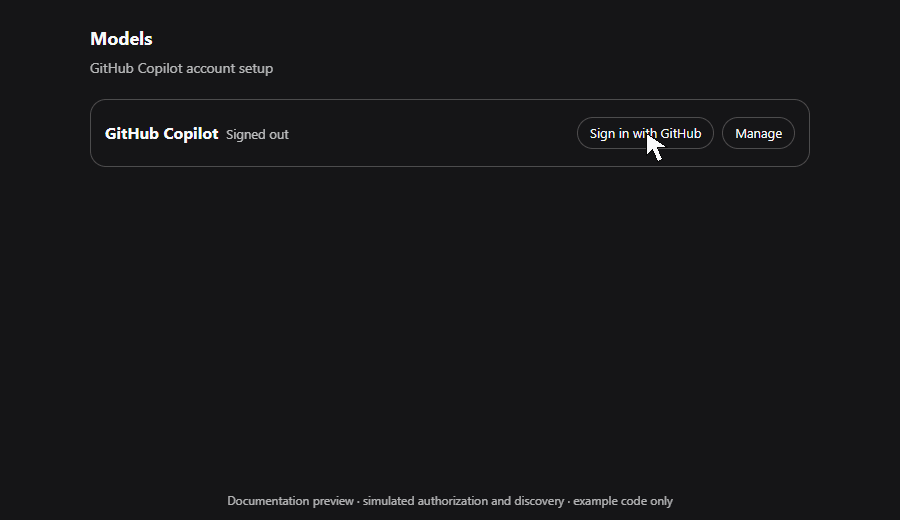
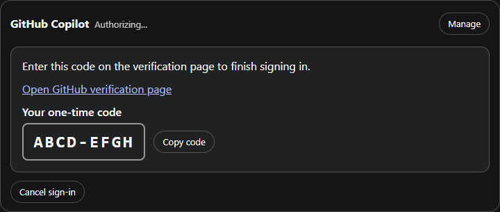
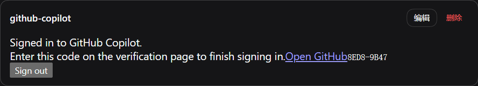

# dsh-github-copilot

[](https://github.com/cloga/dsh-github-copilot/actions/workflows/ci.yml)
[](https://github.com/cloga/dsh-github-copilot/actions/workflows/release.yml)
[](https://github.com/cloga/dsh-github-copilot/releases/latest)
[](./LICENSE)

[English](./README.md) | **简体中文**

一个聚焦 GitHub Copilot 登录、账号感知模型 profile、Copilot 专用 Tool 兼容与供应方托管搜索的 DSH companion。它复用 DSH 内置的 `@deepseek-ai/dsh-llm-pi-ai`，不会再实现第二套 Copilot 模型 adapter 或 catalog。

## 已测试基线

| DSH 表面 | 已测试源码 | Models UI |
|---|---|---|
| 受控 Desktop `0.1.1-rc.2` 基线 | `cloga-pi-ai-model-api` 上的受控 Core commit [`a772dbb`](https://github.com/cloga/deepseek-harness/commit/a772dbbde82780bff2b9394427e9f0a24cafa1d5) | 独立的 **Settings → GitHub Copilot** section |
| DSH `0.1.2-rc.1` | Tag commit [`a66e470`](https://github.com/deepseek-ai/deepseek-harness/commit/a66e4702047846cdaa10c66c9d3df3951f5ea70d) | **Settings → Models** provider card |
| DSH `0.1.3-alpha.1` | Tag commit [`d347e70`](https://github.com/deepseek-ai/deepseek-harness/commit/d347e703908d0406b7a7ef80e3a0e594d86b2215) | **Settings → Models** provider card |

原始 rc.2 tag 不能解析逐模型 `api`，不是经过测试的混合协议基线。Package peer range 只允许上表三个精确 DSH release；升级 DSH 或 pi-ai 后必须先重新做兼容性审查，再修改范围。

## 安装与登录

将当前 release 安装到你实际使用的 profile（其它 profile 请替换 `web`）：

```sh
dsh plugin --profile web add https://github.com/cloga/dsh-github-copilot/releases/download/v0.3.1-alpha.2/dsh-github-copilot-0.3.1-alpha.2.tgz
```

随后打开上表对应的 Models UI，找到 **GitHub Copilot**，点击 **Sign in** 并完成 GitHub device-code 流程。安装会修改指定 profile；是否立即激活取决于该 profile 的常规 reload/restart 策略。

### 用户授权流程

1. 打开 **设置 → 模型**，找到 `github-copilot` provider 卡片。
2. 点击 **Sign in with GitHub**。卡片会显示 **Waiting for GitHub authorization…**，将一次性 device code 作为醒目的独立代码块展示，并提供 **Open GitHub verification page** 链接和 **Copy code** 按钮。
3. 一键复制代码，打开链接，登录拥有 Copilot 权益的 GitHub 账号，粘贴代码并批准授权。复制成功时卡片会给出确认；剪贴板不可用时会提示手工复制。不要把 GitHub token 粘贴到 DSH。
4. 返回 DSH。卡片会自动轮询；成功后只显示 **Signed in to GitHub Copilot.** 和 **Sign out** 按钮，一次性 URL 与代码会消失。
5. 在 `github-copilot` provider 下选择模型。如果没有出现模型，可先重启一次 profile，再查看[迁移与排障](#迁移与排障)。

入口流程从 **添加提供方** 开始，选择 **github-copilot** 后进入 GitHub Copilot 授权卡片：



最终的授权中卡片会突出显示验证码并提供一键复制。截图使用合成的文档示例代码 `ABCD-EFGH`，未发起真实授权请求，也未记录任何 credential。



Device code 是临时信息，只应在授权进行中显示。下面的局部图记录了修复前的异常表现：成功状态旁仍残留旧验证码。当前版本会在授权结束后清除该提示。



### Agent 与自动化流程

Agent 应把浏览器授权视为需要用户完成的 handoff，而不是自行获取 token 的任务：

1. 把固定版本的 release 安装到用户指定的 profile，并按该 profile 的要求 reload/restart。
2. 引导用户进入 **设置 → 模型 → GitHub Copilot → Sign in with GitHub**。
3. 请用户打开界面显示的验证链接并输入一次性代码；不得索取、读取、复制、记录或持久化用户的 GitHub token。
4. 等待用户在浏览器完成授权；已有授权正在进行时，不要重复创建新的登录尝试。
5. 确认卡片显示 **Signed in to GitHub Copilot.**、device-code 提示已消失，并且 Copilot 模型可用。
6. 只有用户明确要求断开账号时才使用 **Sign out**；它会删除 Copilot credential record，但保留 route settings。

GitHub Releases 是唯一权威分发渠道；本仓库不会发布到 npm。部署自动化应 pin 带版本号的 tarball，并使用同一 Release 的 `SHA256SUMS` 校验。

不需要运行 `copilot2api`，不需要外部 gateway、placeholder API key、原始 GitHub token 或单独安装 `dsh-web-search-provider`。

## 本包负责什么

- 为 rc.2 等未挂载 Core authorization service 的 profile 提供条件式 fallback。
- Models provider-card UI、Client-safe Remote descriptor 与 Host authorization controller。
- 对 pi-ai 所有的 Copilot OAuth grant 做严格规范化。
- 按账号可用模型同步 Copilot route 的 `models` 与 `compat.supportsStrictMode` 叶节点。
- 提供临时、账号权限门控的 GPT-6 Astra 兼容层；安装的 pi-ai catalog 原生支持后自动停用。
- 通过 inline agent-loop interception 与 Responses-only `ctx.web` provider 直连供应方 hosted search。

DSH Core 继续负责模型选择、sandbox、工具、附件与其它 provider。`@deepseek-ai/dsh-llm-pi-ai` 负责 Copilot adapter、catalog、OAuth method/grant format、token exchange、refresh 与普通模型 transport。Credential 始终只留在 Host。

## 授权与 route 行为

`llm-pi-ai` 注册 OAuth method，authorization service 组织交互，本包只提供 UI/Remote controller 与 route reconciliation。rc.1 由 Core 提供 authorization；rc.2 profile 缺失该服务时，本包挂载运行时依赖，并复用任何已经存在的 provider。

登录成功、Host 启动以及本包刷新 OAuth credential 后，本包会将账号 `availableModelIds` 与已安装 pi-ai catalog 取交集，并把每个已知模型物化为 `{ id, api }`。对于当前 catalog 不认识的账号模型，本包通常不会猜测协议；唯一例外是精确 ID `gpt-6-astra` 的临时兼容层，其元数据来自 pi 上游与 models.dev。由于已发布的 llm-pi-ai 对 pi-ai 未收录模型要求 route protocol，该兼容层会临时在 route 级选择 `openai-responses`，并且只开放同样使用 Responses 的账号模型；Claude、Gemini 等其它协议模型会明确显示为临时隐藏，而不会被错误路由。安装的 catalog 原生拥有 GPT-6，或账号不再开放它后，route protocol 与过滤会自动撤销。其它未知 ID 会在 Models 卡片中显示 catalog 警告。缺失的 profile 不会引入无关连接引用；已有 profile 只会修改：

- 临时 GPT-6 Responses route mode 生效期间的 `providers.github-copilot.api`
- `providers.github-copilot.models`
- `providers.github-copilot.compat.supportsStrictMode`
- 临时 GPT-6 兼容层需要 Copilot 客户端 headers 时的 `providers.github-copilot.headers`

其它 Copilot 字段和无关 provider 全部保留，包括旧的 `baseURL` 或 `apiKeyEnv`。插件取得临时所有权之前，会把 route 原始的 `api`、`models` 和 `headers` 叶节点编码为隐藏 JSON，存入自己的 settings namespace。兼容层退役时，即使刷新后的账号没有任何可用模型，也会恢复该备份并删除 ownership marker，不会删除其它 route 字段。迁移时必须显式删除旧连接字段。Sign out 本身仍只删除 `llm-pi-ai/github-copilot` credential record，保留 route settings。

Grant 写入或复用前，Host normalizer 只会把 pi-ai 文档化的 `type`、`refresh`、`access`、有限数值 `expires`、可选 `enterpriseUrl` 和去重后的可选 `availableModelIds` 重建为新的普通 JSON 对象。

## Hosted search

- **Inline agent-loop 路径：**支持 OpenAI Responses 与 Anthropic Messages 的原生搜索候选。
- **通过 `ctx.web.search()` 使用 `github-copilot-hosted`：**只支持 OpenAI Responses 候选。
- **Chat Completions 模型：**仍可走普通 `llm-pi-ai` transport，但不会宣称 hosted search 可用。

请求经过严格 Host 校验后，直接发往 credential 解析出的 HTTPS Copilot endpoint：GitHub-hosted `api.*.githubcopilot.com`，或已接受 GitHub Enterprise credential 对应的 `copilot-api.<signed-in-enterprise-domain>`。Credential 不会经过外部 gateway。

默认 `probe: true` 时，搜索 fail closed：当前 route 必须是 `github-copilot`，账号必须允许该模型，安装的协议必须支持原生搜索，且 bounded capability probe 必须成功。显式设置 `probe: false` 只会跳过 capability proof，并信任所选原生协议；route、account、protocol、endpoint 与 authentication 检查仍然生效。Authentication、HTTP、响应体格式、abort 或网络 probe 失败都不会回退到外部搜索路径。请求只要包含任意 Core file block（包括嵌套在 tool-result content 内的文件），也会 fail closed 到 `next()`，由 Core 保留文件投影，避免 hosted-search serializer 静默丢弃文件上下文。

## Copilot Tool 兼容

为避免已观察到的无效 Copilot Tool payload，本包会把托管 route 的 `compat.supportsStrictMode` 叶节点设为 `false`，并在所选 provider 严格等于 `github-copilot` 时执行两项仅作用于 Schema 的修复：从 Tool Schema 顶层删除 `sandbox_permissions` 与 `justification`，并把 Core 的多动作 `update_goal` 参数改写为带判别字段的 `oneOf`。这样每种 Goal action 只暴露合法字段：`complete`、`pause`、`resume` 不会携带编辑或阻塞字段，`blocked` 必须提供 `blocked_reason`，只有 `edit` 暴露替换字段。执行仍使用 Core 原本的 Goal Tool 与 Service。非 Copilot prompt assembly 完全不变。

Copilot Session 如需更宽的文件或命令权限，必须在调用前选择足够的 standing permission。安装代理还必须遵循：

- 初次 `pwsh` 调用不发送 `sandbox_permissions` 和 `justification`。
- Approval prompt 已关闭或当前已是 `danger-full-access` 时绝不发送。
- 只有真实 sandbox denial、approval 可用且目标模式更宽时，才能在同一命令的一次重试中发送。
- 必须完全省略字段，不能发送 null、空值或当前模式。

插件不会重写 `$DSH_HOME/AGENTS.md`。安装程序只有取得用户明确同意后，才能把规则合并进用户指令。

## 设置

`github-copilot` settings section 只控制 hosted search：

| 键 | 默认值 | 作用范围与含义 |
|---|---:|---|
| `enabled` | `true` | 启用两种 hosted-search 表面。 |
| `providers` | `[]` | 两种表面的可选 route allowlist；空值跟随当前选择。 |
| `includeSources` | `true` | Inline 路径请求供应方引用；`ctx.web` bridge 始终请求并返回 sources。 |
| `stripServerTools` | `true` | Inline 路径删除 hosted-search tool 的本地 function 变体。 |
| `idleTimeoutMs` | `300000` | Inline stream 空闲超时以及 `ctx.web` 请求 deadline，单位毫秒。 |
| `probe` | `true` | 两种表面都要求 capability proof；`false` 表示显式信任原生协议。 |
| `probeTimeoutMs` | `30000` | 整段 capability probe deadline，单位毫秒。 |

本包不提供 token、API key、model catalog 或 endpoint 设置。

## 迁移与排障

依赖托管 route 前，请删除旧 gateway route、`COPILOT_GITHUB_TOKEN` 类 reference、`copilot2api` 与 `dsh-web-search-provider`。

- **看不到登录控件：**确认 package 安装在当前活动 profile，并使用上表对应的 Models UI。
- **已登录但新模型缺失：**查看 Models 卡片中的 catalog 警告。账号返回精确 ID `gpt-6-astra` 时，插件会临时识别 GPT-6 Astra；兼容模式生效期间，非 Responses 账号模型会列为临时隐藏。若要恢复混合协议 route，可在账号策略中移除 GPT-6，或安装带原生支持的 pi-ai。其它未知 ID 会等到经过验证的元数据可用后再开放。
- **Hosted search 不可用：**选择 `github-copilot` route 和账号可用的 Responses/Anthropic 模型，并检查命名明确的 probe error；显式 `ctx.web` provider 仅支持 Responses。
- **仍有旧 endpoint/key：**reconciliation 会有意保留不归本包所有的字段，需要手工删除旧连接字段。

## Package 入口与源码映射

公开 export 为 `.`, `./client`, `./remote`, `./deployment-baseline.json` 和 `./package.json`。

- `src/index.ts`：authorization bootstrap、依赖门控 Host 组合、settings、inline interception 与 `ctx.web` 注册。
- `src/authorization-controller.ts`：Host authorization 与路径级 route reconciliation。
- `src/copilot-grant.ts`、`src/copilot-auth.ts`：grant normalization 与 Host credential lifecycle。
- `src/client.ts`、`src/remote.ts`：Models UI 与 Client-safe Remote contract。
- `src/current-provider.ts`、`src/temporary-models.ts`、`src/plan.ts`、`src/probe.ts`：route 投影、自动退役的 GPT-6 兼容层、候选规划与 capability proof。
- `src/wire.ts`、`src/wire-anthropic.ts`、`src/traditional-search.ts`：hosted-search transport。
- `deployment-baseline.json`：声明式、机器可读的兼容性/能力证据清单；`scripts/verify-deployment-baseline.mjs` 用源码与测试 marker 检查漂移。
- `lib/`：构建生成的 release 输出，禁止手工修改。

## 构建与验证

```sh
pnpm install --frozen-lockfile
pnpm verify
pnpm pack --pack-destination artifacts
```

`pnpm verify` 执行 typecheck、deployment baseline 检查、build、全部测试和 package export smoke。CI 还会在 Windows/Linux 上分别验证精确的受控 rc.2 与 rc.1 upstream 源码。

## Release 与 checksum 校验

`package.json` 标记为 private，以防发布到 registry。Release tag 必须严格等于 `v${package.json.version}`。新版本使用标准 SemVer 预发布标识（`alpha`、`beta` 或 `rc`）；历史上的 `cloga` 后缀用于标识下游 fork 构建，新版本不再使用。Release workflow 会执行 frozen install 和完整验证门禁、打包 tarball、写入 `SHA256SUMS`，按版本标记 prerelease，并且只在前序步骤全部成功后创建 GitHub Release。

```sh
curl -LO https://github.com/cloga/dsh-github-copilot/releases/download/v0.3.1-alpha.2/dsh-github-copilot-0.3.1-alpha.2.tgz
curl -LO https://github.com/cloga/dsh-github-copilot/releases/download/v0.3.1-alpha.2/SHA256SUMS
sha256sum --check SHA256SUMS
```

PowerShell 可以对已下载的同一组文件执行：

```powershell
$expected = (Get-Content .\SHA256SUMS).Split()[0]
$actual = (Get-FileHash .\dsh-github-copilot-0.3.1-alpha.2.tgz -Algorithm SHA256).Hash.ToLowerInvariant()
if ($actual -cne $expected) { throw 'Release checksum mismatch' }
```

Checksum 用于检测下载损坏或 asset 漂移；repository controls 与受保护的 Release workflow 用于建立发布方 provenance。绝不能移动或复用 release tag；每次发布必须同时递增 package 与 deployment baseline 版本。修改流程见 [CONTRIBUTING.md](./CONTRIBUTING.md)，安全问题的私密报告方式见 [SECURITY.md](./SECURITY.md)。
