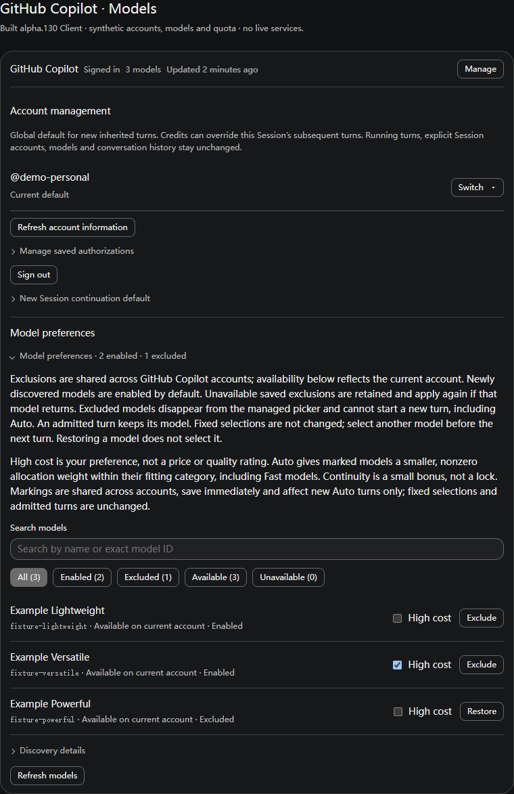
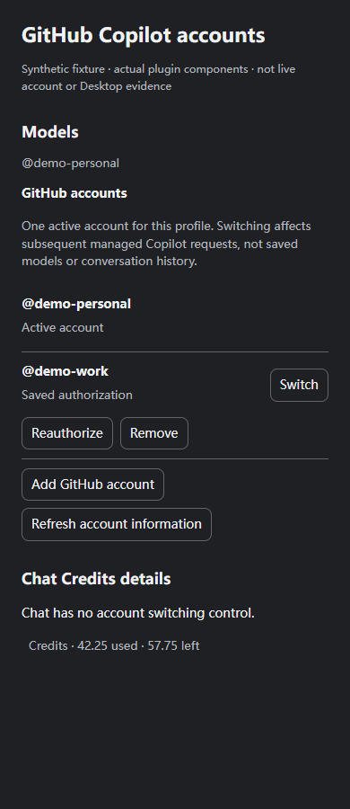
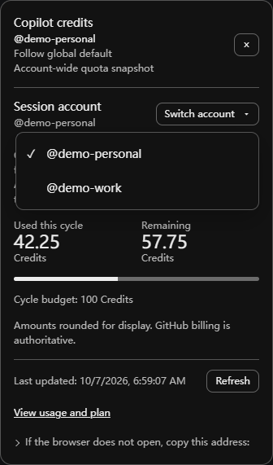
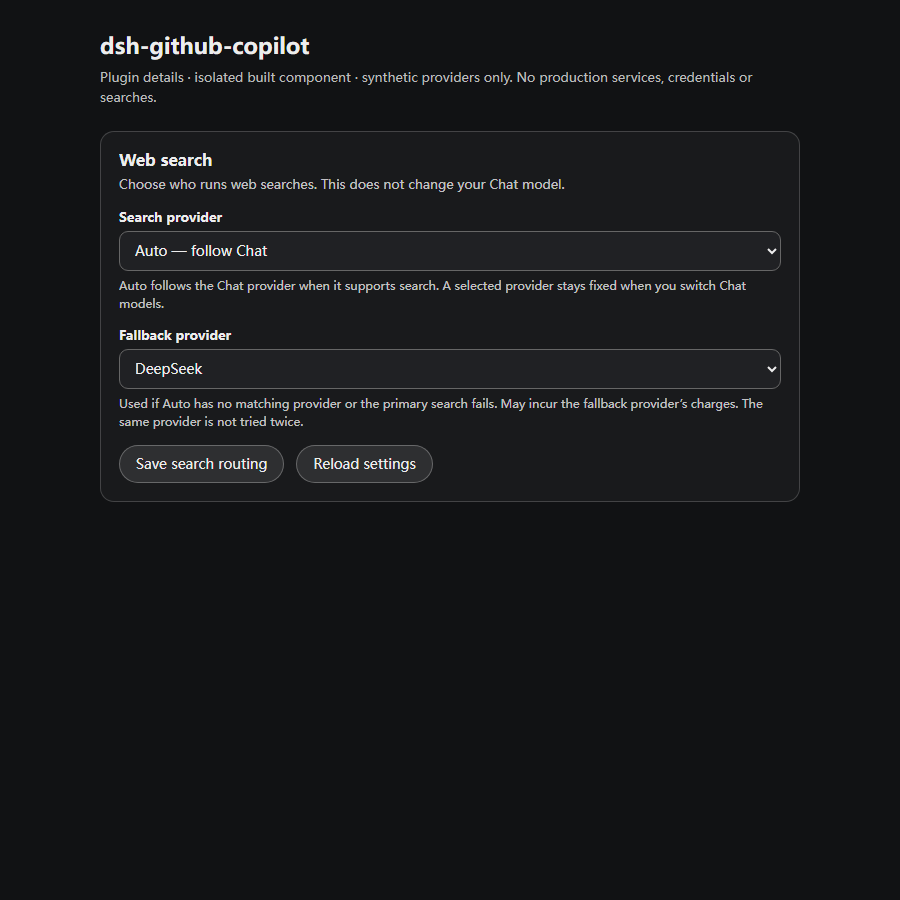

# dsh-github-copilot

[](https://github.com/cloga/dsh-github-copilot/actions/workflows/ci.yml)
[](https://github.com/cloga/dsh-github-copilot/releases)
[](./LICENSE)

[English](./README.md) | **简体中文**

为 DSH 提供 GitHub Copilot 账号模型发现、上下文 Auto 选模和 hosted search。插件复用 DSH 公开的原生适配器，保留 profile 全局默认账号，并支持 Session 后续 turn 指定独立账号；不修改 Core，也不维护第二套模型目录。

**当前发布：[`0.4.0-alpha.133`](https://github.com/cloga/dsh-github-copilot/releases/tag/v0.4.0-alpha.133)。支持宿主：官方 DSH / Windows Desktop `0.2.0-rc.2`。** 仍为 alpha 版本，未升级为稳定发布通道。较早 DSH pin 仅是历史证据，不是当前安装目标。已发布、已安装到 profile、已被运行中的 Host 加载，是三个不同状态。

## 你可以做什么

**高成本 Auto：**在 **Manage → Model preferences** 中用 **High cost** 标记
模型。成本与任务难度正交：第一个可容纳输入的同类候选池内，普通模型权重为 `1`，
高成本模型为 `0.2`，上一轮模型仅获得 `1.5×` 的有限加权。每个合格候选都有非零机会；
标记不改变手动选择或已接纳的 turn。这是路由政策，不是价格／质量排名，也不证明节省费用。

现有 turn 选择说明内提供 **Auto allocation observations**，显示当前 Session
保留的候选机会、预期份额与实际选择，并提供只读 JSON 导出。不自动上传，也不写入持久
历史；重启或淘汰会丢失观察。设置 `autoAllocationEvidence: false` 可停止后续候选
记录，不改变路由；此前观察保留至销毁、淘汰或重启。辅助分类器独立优先使用未标记的
合格 Lightweight 模型。顾问求助尚未实现。参见[完整需求](./docs/auto-high-cost.md)
与[强制迭代评审流程](./docs/evidence-driven-iteration.md)。

[本地诊断试点](./docs/plugin-diagnostics.md)记录有界的账号／Checking 与压缩
汇总，**默认关闭**。安装并加载已发布版本后，进入插件详情设置页 →
**Local diagnostics → Read status → Enable local collection**，开启本地持久化；
不上传，不启用定时分析。包内另提供显式离线分析器，只处理调用者指定的持久化单元
或经审阅的聚合视图，并且只新建本地报告文件；不会扫描、上传或更改采集设置。
暂停保留证据，清除需单独确认。Client／Host 分开统计，未覆盖路径、报告丢失与存储
故障明确显示。描述性计数不是历史重建、错误率，也不表示优化效果已被验证。

在已构建的包或源码 checkout 内，显式分析已核验的文件：

```sh
node scripts/analyze-diagnostics.mjs --input "ABSOLUTE_UNIT_FILE.json" --mode persisted-unit --profile-name "PROFILE_NAME" --output "NEW_LOCAL_REPORT.json"
```

请把占位符替换为经审阅的文件／profile 和新的绝对输出路径。分析经审阅的聚合视图导出时，使用 `--mode reviewed-view`，不传 `--profile-name`。[读取核验与解释限制](./docs/plugin-diagnostics.md#explicit-offline-analysis-368)说明格式、边界及仅持久化证据的含义；不包含每日定时任务。

| 任务 | 入口 |
|---|---|
| 登录并管理账号模型 | **设置 → 模型 → GitHub Copilot → Sign in** |
| 添加／切换 GitHub 账号 | **Manage → 账号管理 → 切换**；仅限托管路由 profile |
| 指定本 Session 后续 turn 的账号 | **Credits → Switch account**；仅选择已保存授权 |
| 排除／恢复单个模型 | **Manage → Model preferences** |
| 自动选择模型 | 选择 **Auto · Balance / Efficiency / Intelligence** |
| 让受支持子代理跟随父模型 | **插件 → dsh-github-copilot → 详情 → Follow parent model** |
| 设置搜索主 provider 与最终 fallback | **插件详情 → Web search** |
| 查看账号 Credits 与上下文证据 | Copilot 会话输入框；原生 Turn Usage 独立保留 |



当前 alpha.130 构建的真实 Client 组件，运行于隔离浏览器，账号与模型均为模拟。Manage 包含账号控件、续聊默认值和模型偏好（包括 High cost）。图片仅说明界面，不证明真实登录、模型可用性或 Desktop 已加载。





这两张截图使用相同的当前构建组件及模拟身份／额度。Models 更改全局默认，Credits 仅更改本 Session 后续 turn 的账号；不包含真实账号或账单数据。[截图来源](./docs/images/copilot-current-provenance.json)随图片一同分发。

## 安装与登录

使用已校验的固定版本、指定 profile 和获准的包源。不需要 `copilot2api`、外部网关、手工粘贴 GitHub token、占位 key 或另装 `dsh-web-search-provider`。

安装前，解包已核验 checksum 的归档，以绝对路径运行包内**只读组合预检**：

```sh
node package/scripts/check-search-composition.mjs --profile-dir /absolute/profile --home /absolute/DSH_HOME --install-anchor /absolute/dsh/package.json
```

启动 patch 用重复的 `--patch /absolute/file` 提供。必须得到 `supported: true`；安装器不会自动执行此预检。不支持的／自定义 Web 组合及 `NONEMPTY_DISPOSABLE_PROFILE_ROOT` 均须停止。先保全非空 root，并核对公开组合能否完整重建，再另行批准规范化；不能默认清空。检查实际共享 peer 解析，避免旧 profile-local 包遮蔽官方 Desktop peer。

**独立具名 profile**：

```sh
dsh plugin --profile web add https://github.com/cloga/dsh-github-copilot/releases/download/v0.4.0-alpha.133/dsh-github-copilot-0.4.0-alpha.133.tgz
```

**Desktop** 原生包管理器在发布后接受 `dsh-github-copilot@0.4.0-alpha.133`。官方 rc.2 **Desktop 随附的专属 CLI**也支持管理保留 profile；全局／普通 `dsh` shim 不等价。使用前核验实际安装入口，参见[Desktop CLI 核验](./docs/npm-distribution.md#desktop-bundled-cli-on-official-rc2)及独立的[具名 profile 离线流程](./docs/npm-distribution.md#controlled-offline-cli-maintenance-for-standalone-profiles)。两种路径都不授权绕过包源政策、修改 peer 或删除配置。

经批准 reload/restart 后：

1. 打开**设置 → 模型 → GitHub Copilot**，选择 **Sign in with GitHub**。不需要添加原生 provider 或手工定义模型。
2. 复制一次性验证码，在自己的浏览器完成 GitHub device flow。Desktop 交给系统浏览器；未打开时仍可复制界面中的验证网址。
3. 等待 **Signed in** 和账号发现完成，再选择模型。打开 Models 和正常使用会确保缺失／过期元数据；**Manage → Refresh models**用于有意强制刷新，不是日常设置前提。

退出须显式操作，只删除活动账号的授权，保留其它授权与路由设置。升级保留已有原生 Copilot profile；在[显式单路由迁移](./docs/single-route-migration.md)前，仍可能存在两个分组。安装不迁移会话或默认模型。

在 **Manage → 账号管理**内，**切换**下拉菜单列出已保存账号，底部为**添加 GitHub 账号**。添加不会替换全局默认。设备授权期间显示验证网址、一次性授权码、**复制授权码**和**取消添加账号**；随后单独验证身份和模型。确认切换只影响后续继承默认的新 turn，不改变运行中 turn 或 Session 已指定账号。**管理已保存授权**包含**重新授权**和**移除**；移除仅影响非默认的本地已保存授权，不改变运行中 turn 锁定的账号或 GitHub 端访问。**刷新账号信息**只更新身份，不操作授权。原生路由或不完整证据阻止切换；账号缺失／失效不会自动回退。新账号可能缺少已选模型，旧加密 replay 也可能绑定原账号；不自动替换模型或删除历史。参见[账号需求](./docs/copilot-accounts.md)。

已完成的托管 turn 在原生 Usage 旁显示 **Account**，记录实际请求账号，不是计费归因或子 Agent 汇总。准入时冻结已验证名称；缺失时针对本轮固定账号执行现有的有界、非强制查询，不阻塞模型输出，只能在同一 turn 仍运行时补齐身份。没有原生流返回就没有账号执行证据。未查到的身份仍显示不可用；不会根据当前设置补写已完成历史。证据仅在 Host 生命周期内有界保留，重启及冷历史显示未知。Credits 对身份未知的原始／已保存授权显示可读标签，不显示不透明账号 ID。

读取已保存账号名称不必激活账号。名称在 Host 生命周期内缓存，凭据变更或验证失败会失效，也不证明授权或模型可用。全局切换需要新鲜身份／模型验证及设置持久化确认。切换被阻止时，等待授权或锁定工作结束，再**刷新账号信息**；未知路由／活动证据仍是阻塞。选择入口是下拉菜单，不是每个已保存账号旁的按钮。

**Desktop 生命周期：**停用、移除、升级后的 Web 服务重组可能需要完整冷重启。若插件已 Off，而原生 manager 仅提示 `pending (waiting for service: web)`，不要反复切换或重装。先取得重启许可，遵循[rc.2 生命周期说明](./docs/web-lifecycle-rc2.md)。

## Auto 与模型偏好

**保存偏好：**Exclude/Restore 和 High cost 即时保存，并等待设置读回确认。其它行仍可操作：最多 32 个不同行的修改显示 **Waiting…**，同时只有一个 **Saving…**。结果不明确或作用域变更时取消尚未发送的修改；**Retry** 只读取已保存设置，不重放写入。卸载后不保留队列。

**模型目录加载失败：**原生 Models 的 `llm/listProviders failed: Failed to fetch` 属于 Client 到 Host／网关的传输失败，不能证明强制 Copilot 发现。连接恢复后使用原生页面的 **Retry**；插件不以过期或空目录替代。

三档 Auto 共用账号验证、未排除的合格模型池。输入／图片能力等硬门槛先于任务偏好。

| 任务需求 | Efficiency | Balance | Intelligence |
|---|---|---|---|
| 已证实简单 | Lightweight | Lightweight | Lightweight |
| 常规 | Lightweight | Versatile | Powerful |
| 复杂 | Powerful | Powerful | Powerful |
| 未知 | Versatile | Versatile | Powerful |

分类来自认证后的供应方元数据，不按模型名、上下文容量或臆测质量排名。在第一个可容纳输入的分类内，按前述正成本权重和有限连续性加权选择；上一模型合适也不会无条件保留。分类回退明确说明。同一已准入 turn 的工具步骤和重试保持同一真实回答模型；压缩保留独立解析的原生摘要路由。

语义判断**默认开启，仅用于本地需求未知的任务**。最多一次辅助请求，**8 秒端到端期限、128 tokens 输出预算**。可用 `github-copilot.autoSemanticAssessment: false` 关闭。超时／无效结果保留未知，再按偏好兜底，不解释为简单，也不换分类模型重试。用户取消和账号失效仍终止请求。辅助调用增加延迟与供应方费用，不计入原生回答 Usage。

准备、原生请求和结果边界均用单调时钟检查期限，不依赖定时器及时执行。事件循环延迟可能推迟结束，但不授权超期发起请求或接受结果。合格 Lightweight 分类模型优先考虑声明 reasoning `off` 的候选，同级按 ID 确定顺序；只有公开原生模型也支持时才发送 `off`。这不是实测速率排名。解释分别说明该分类的可容纳候选数和上一模型连续性，不将保留上一模型说成语义优选。

回复的选模说明展示捕获的理由和可选的不含内容的辅助里程碑。`uncertain`、`insufficient-evidence` 不等于会话没有上下文。**Selection unknown**表示记录未保留，**Selection unavailable → Retry**表示读取失败；Retry 只重读该 turn，不重新推理。证据有界且仅限 Host 生命周期，重启／淘汰可能丢失。

失败／不完整轮次的原生 Usage 没有模型行时，沿用现有 ⓘ 打开**本轮模型与选择记录**：本轮成功消息来源显示**已记录模型**并提示失败尝试归属不完整；可靠的本轮已记录请求配置仅显示**请求模型**，不证明发送、执行或计费。缺失证据显示**未知**，不从当前选择、全局默认或相邻轮次倒推。原选模说明折叠在下方；原生完整模型记录不重复展示，没有关闭消息的轮次没有现有入口。原生 Usage 与重试保持不变。[证据边界](./docs/automatic-model-routing.md#attribution-and-explanation)。

**模型排除**将精确 ID 移出托管 picker 与新 turn 的 Auto 候选。已选模型也能排除：已准入 turn 保持原模型，但新 turn／直接调用不得使用；固定选择不会静默替换。偏好状态未知时只读，不伪装为已启用。保存采用窄范围原生 CAS，不读凭据、不发现模型、不扫描会话。

详见[任务判断](./docs/auto-task-routing.md)与[路由合同、排除和历史恢复](./docs/automatic-model-routing.md)。

显式 Auto 意图通过插件对现有选择事件的独立投影保留，不因原生 pending 被消费或冷恢复而丢失。后续显式固定选择仍从未来轮次生效，已准入轮次保持原路由。不会补写历史选择理由，也不会把未知证据猜成 Auto。

## 子代理与搜索



当前 alpha.130 构建的插件详情页，设置／provider 为模拟，诊断为暂停且无数据。截图没有发起搜索、采集或调用真实服务。

**Follow parent model**默认关闭，在当前 profile 内作用于托管 Copilot 父会话的受支持原生子代理／Team mate。固定父模型从子会话下一 turn 生效；Auto 父会话传递准确偏好，子会话按自己的上下文选模。子会话的显式选择优先。运行中 turn、root、fork、其它 provider、旧专用策略不被改写；关闭宽泛开关也不移除旧绑定。[父模型跟随合同](./docs/parent-model-follow.md)。

**Web search**仅有两个常规选项：主 provider 与最终 fallback。Auto 在存在对应搜索注册时跟随发起 Chat provider；固定 provider 不随 Chat 模型改变。最多尝试一个不同的最终 fallback，明确提示可能费用；取消或账号 proof 失效不授权 fallback。

Copilot 搜索要求当前账号／协议证据及能力 proof。固定／fallback Copilot 保留非空旧 `searchModel`；否则最多考虑三个账号 Responses 候选。最终用户查询只发送一次，不跨候选重放。设置保存或 Chat 成功不证明 hosted search 可用。[搜索路由与组合](./docs/session-search-routing.md)。

旧 `github-copilot.searchFallback` 只控制独立的 canonical inline 路径，不是路由搜索的第三层 fallback；网页抓取不变。

## 用量、请求限制与恢复

**Credits**展示已验证账号计费周期数据，不是上下文 tokens 或会话成本。过期、组织共享及不可用数据保留真实语义。仅额度请求在保持 TLS 验签下合并 Node 与系统 CA；不改变登录、模型、搜索或整个 Desktop 的信任配置。

原生上下文占用与 Turn Usage 由 Core 所有。插件原样转发 usage，包括失败／取消时的零样本。普通请求进行中或暂时没有新采样时保持安静；只有明确的失败零采样或无效采样事件才显示可关闭的独立上下文警告。保留的计数只标记为历史证据，不推断当前占用或替代百分比。**Turn Usage incomplete**解释缺失样本／生命周期及已记录本地阻断，不编造零用量或部分总和。取消可以保留 usage，但不保证收到供应方最终回执。[用量边界](./docs/copilot-usage.md)。

插件恢复 timeout／replay 结构化错误前会保留原生 usage，包括非零采样。失败的零采样仍可能让原生圆环显示 `0%`，不代表请求上下文为空。重试条目的耗时表示退避等待，不是失败请求耗时；用量修复不等于解决供应方 HTTP 408，也不改变重试策略。

压缩规划只估算模型可见内容和工具，不把原生 ID／来源信息或不透明 replay 信封计入预算，避免元数据导致耗尽 16 次调用。原消息和 replay 保持不变，最终原生准入仍检查转换后的输入。明确容量错误的兜底保留固定前缀和完整工具调用组，不原样重发不可拆分的失败输入。这是保守规划，不是供应商精确 token 计量。

托管请求准入保留真实输入／输出上限和原生事务。自动压力使用发起 Agent 真正绑定的压缩服务；preset 无引擎时不能借用全局恢复。另行选用的[恢复引擎](./docs/manual-compaction-recovery.md)默认对已超限摘要或明确的摘要上下文超限错误启用自动分段兜底。能一次完成的摘要仍走原生流程；超时／408／认证／额度错误不会触发分段。最多 16 次调用可能增加耗时和费用，取消或恢复未完成不会提交半成品摘要。`automaticRecovery: false` 仅关闭自动分段，原生 `auto: false` 仍关闭自动压缩。仅安装插件不会选用该引擎：需按文档显式替换同一作用域的引擎配置，保留 preset／自定义引擎所有权及原有策略。

同一轮后续步骤已有托管路由、且没有待切换模型时，已知输入压力会在 Core 开始下次模型尝试之前压缩。原生压缩成功可避免一次无 usage 样本的本地压力拒绝导致整轮 Usage 不可用。首次步骤、待切换模型、新增固定前缀膨胀与最终硬预算拒绝仍保留原有准入；不会修复历史总量或虚构缺失用量。

**“降级续聊”也覆盖本 Session 的原生托管 Responses 压缩，包括自动摘要**：开启后不需要额外手动恢复命令，也不必先失败再重试。发出的输入省略旧加密 reasoning 及其内嵌摘要，隐藏上下文可能丢失；可见消息、工具调用／结果关系和原历史保留，仅由原生事务提交更小的检查点。输入区提示降级，并区分已提交、失败和取消。关闭时，明确的回放作用域拒绝提供同一个带损失说明的开启入口；未知错误不授权降级。`/copilot-compact visible-history` 保留为已选用恢复引擎的一次性高级入口。参见[授权与恢复限制](./docs/manual-compaction-recovery.md#explicit-visible-history-summary-recovery)；这不启用缺失的引擎，也不修复容量、额度或超时问题。

输入区在原有八秒结果窗口内分别说明**压缩已完成**和**后续请求已成功**，不会把普通请求进度或暂时没有新采样变成常驻警告。后续明确的采样事件可独立出现，并可展示标记清楚的历史计数，但绝不推算占用百分比。插件不额外发送测试请求、不增加重试，保留原生圆环、Usage 记账及可展开的压缩历史。参见[上下文证据](./docs/copilot-usage.md#historical-context-evidence)。

可见历史压缩进行中时提示持续可见。确认成功后从首次观察起八秒自动消失；失败、取消、状态不可用和开启提示保留至手动**关闭**（或原有**取消**）。关闭仅隐藏当前 Session／操作／状态的提示，不改变授权、历史或原生证据，不发送或重试。Client 注册范围内的有界状态使临时重挂载和会话切换不会重置期限；注册销毁或记录淘汰后不保留。

严格核验的 `408 / user_request_timeout`诊断给出有界请求构成和可观察耗时，不证明供应方 payload 上限或根因。图片统计包括原生 Responses 工具输出中的图片；旧的已存诊断可能把这些图片算作剩余历史。字节不是 tokens，耗时不是上传时长；小型无图请求也可能超时。参见[预算与超时指导](./docs/copilot-compaction.md)，不要自动裁剪历史、禁用 proof、切换模型或增加重试。

实验性配置 `github-copilot.responsesRequestCompression` **默认关闭**。显式开启后，仅通过现有原生 Fetch 接口对符合条件的托管 HTTP Responses 请求进行无损 gzip 编码。请求至少 256 KiB；超过 32 MiB 的压缩工作会跳过，且必须同时节省至少 5% 和 4 KiB；任何跳过都会发送原始请求。这只改变准备发送的 HTTP body 字节，不改变 context/token 准入。自定义 Fetch、显式 `auto`／WebSocket 和其他协议维持原生行为；gzip 被拒绝后绝不会自动改成未压缩请求重发。严格核验的 408 诊断会区分原始 JSON 组成字节与准备发送的 gzip body 大小；两者均不证明请求已送达，也不保证消除超时。安装不会启用此选项。

同一失败还可包含请求级原生客户端的本地请求体写入／响应头里程碑、协商出的 TLS ALPN 与 Node 写缓冲字节数。这些只是本地提交观测，不是内核 ACK 或供应方接收证明；缺失事件不代表上传未完成。不支持或存在歧义的传输会明确报告证据不可用。不记录请求内容，也不改变连接、代理、dispatcher 或重试。

HTTP/SSE liveness 默认区分 5 分钟字节 idle 和有界的 10 分钟助手输出静默，排除消费者工作；WebSocket／显式 `auto`仍仅使用原生路径。这不修复供应方 HTTP 408。图片按原生实际投影 MIME 证据准入；插件不负责转换，也不按文件名猜格式支持。[图片兼容](./docs/image-input-compatibility.md)。

原生 rc.2 Auto 授权审查以 `temperature: 0` 请求所选路由。没有经验证的供应方契约能证明 `capabilities.supports.thinking` 决定 temperature 是否受支持；此元数据不会用于该判断。显式兼容覆盖项 `github-copilot.responsesOmitTemperature` 默认 `false`。只有在用户接受影响范围时才设为 `true`：无论原生传输方式如何，它都会从**所有**账号发现的托管 OpenAI Responses 请求中省略 temperature，可能解决已报告的 reviewer 400，但也会改变该托管协议上普通聊天及其它请求的 temperature 语义。它不影响 Chat Completions、Anthropic Messages 或 Core 所有的 canonical Copilot 路由。插件不会自动启用或迁移该设置。冻结的 reviewer 请求、严格 verdict 解析、取消和失败关闭的工具拒绝保持不变；错误不会重试。参见[模型兼容性验收](./docs/model-compatibility-acceptance.md)。

## 设置与排障

配置位于 `github-copilot`。凭据、endpoint 和静态模型目录不是插件设置。

| Key | 默认值 | 用途 |
|---|---:|---|
| `autoSemanticAssessment` | `true` | 本地未知任务的一次辅助判断 |
| `followParentModel` | `false` | 受支持子代理跟随，子会话显式选择优先 |
| `excludedModelIds` | `[]` | Model preferences 保存的精确排除 |
| `accountModelTtlMs` | `86400000` | 最多复用元数据 24h，不延长 token/proof |
| `accountModelFailureCooldownMs` | `300000` | 非强制发现失败冷却 5min |
| `chatStreamLiveness` | `true` | 托管 HTTP/SSE 字节观察 |
| `chatStreamIdleTimeoutMs` | `300000` | 字节 idle 期限，与搜索独立 |
| `responsesRequestCompression` | `false` | 实验性托管 HTTP Responses 无损 gzip |
| `responsesOmitTemperature` | `false` | 从每个托管 Responses 请求显式省略 temperature |
| `chatMaxRequestImageBytes` | `20971520` | 原生 20 MiB 出站图片预算，非总 JSON 上限 |
| `requestBudgetSafetyTokens` | `4096` | 估算输入安全余量 |
| `requestBudgetPressureRatio` | `0.9` | 启用受支持恢复时的提前压力 |
| `compactionReasoning` | `prefer-low` | 未解析 effort 时采用受支持低档 |
| `enabled` / `probe` | `true` / `true` | Hosted search／能力 proof |
| `providers` | `[]` | 可选显式搜索路由 allowlist |
| `includeSources` / `stripServerTools` | `true` / `true` | Inline 引用／托管工具 schema 处理 |
| `idleTimeoutMs` / `probeTimeoutMs` | `300000` / `30000` | 搜索请求／probe 期限 |

| 现象 | 安全下一步 |
|---|---|
| 无登录控件 | 核对活动 profile 与已加载 Host/Client；不要只为显示登录而添加原生 provider |
| 已登录但缺模型 | 查看发现诊断，使用 Retry 或有意 Refresh，不反复登录 |
| 两个 Copilot 分组 | 审核[显式迁移](./docs/single-route-migration.md)，不会自动移除 |
| 选模未知／不可读 | 区分记录丢失与读取失败；Retry 只重读 |
| 缺失／取消后的 Turn Usage | 查看[用量限制](./docs/copilot-usage.md)，不推断零计费 |
| 历史加载报 `github-copilot/auto-model-decision` | 使用[独立副本、先检查的恢复](./docs/automatic-model-routing.md#recovering-affected-histories)；未经批准且未停写不得替换实际历史 |
| AUTH、Responses replay scope 或 TLS 错误 | 查看[请求诊断](./docs/model-compatibility-acceptance.md#authentication-replay-and-request-diagnostics)及[额度 TLS 边界](./docs/copilot-usage.md#account-data-boundary)。精确 scope 拒绝后，**回放恢复**使用同一个持久 Session 降级续聊策略：关闭时说明损失并提供**开启降级续聊**／取消，已开启时只显示诊断，不重复授权。不再选择授权范围或仅下一轮；失败证据过期不会关闭策略。需另行使用原生重试，不自动发送／重试、不改磁盘历史，也不是 408 修复。不自动重置凭据或关闭 TLS。 |
| Hosted search 不可用 | 检查账号／协议／probe 诊断；旧 override 保留至显式 reset |

账号保存确认后立即恢复控件，不等待额度读取。同账号仅改变跟随方式时保留已确认归属的额度，不重复读取；真正换账号时清除旧额度，独立加载新快照，不阻塞后续账号编辑。额度读取失败不会撤销已经确认的账号选择。

Credits 账号面板显示当前账号和 **切换**，下拉菜单只列已有账号，为当前实际账号打勾，长列表内部滚动。**跟随全局默认**是独立复选框：开启时清除本会话指定，关闭时固定当前账号；手动选择账号也会固定，即使所选恰好是当前全局默认。两种操作均保持续聊确认和 revision 校验保存。添加账号只留在 Models，其 **管理** 展开账号管理与共享模型偏好，菜单底部添加账号但不自动选中，并保留重新授权与受保护的本地账号移除。两处都没有账号搜索框。按精确模型 ID 共享排除偏好，可用性仍按账号验证。参见[已确认体验与交互 mock](./docs/account-management-experience.md)。

[可见历史续聊模式](./docs/session-continuation.md)放在账号切换旁，不再常驻输入框上方。功能首次成功激活后创建的非继承 Session 默认开启；已有 Session、继承历史仍需明确授权。全局默认只影响新 Session，Session 开关跨账号及重启保留，直到关闭。关闭时切换到不同账号，提供持续开启、保持关闭或取消，不再提供仅下一轮模式。启用后的每个新 turn 省略旧加密推理及其内嵌摘要，同账号也适用；当前轮新推理、可见消息、工具记录和磁盘历史不变。授权不自动发送或重试，不解决额度或上下文超限。精确回放失败使用同一个持久策略，用户另行点击原生重试。当前 Core 没有公开 Models 直达 API，Chat 不展示不可用的管理入口；完整管理仍在设置 → 模型 → GitHub Copilot → 管理。

上下文证据与回放恢复以紧凑、居中提示显示在输入框上方，宽度遵循原生输入框。模型、项数和状态刷新收进默认折叠的技术详情；有损恢复仍需明确确认。上下文采样只在明确事件时告警，可按 Session／事件关闭，且不会断言原生仪表当前值；原生统计不变。切换账号不会让旧加密推理自动变得可跨账号使用。简短 scope 错误指向显式恢复或新会话；有界、脱敏的请求结构计数留在 Host 诊断中，不挤占主错误。**已授权**只表示授权已准备好，不表示消息已发送或恢复已成功。

## 所有权与深入阅读

DSH Core 所有会话、工具、sandbox、附件、原生计量和其它 provider；`llm-pi-ai`所有 OAuth、token 交换／刷新和普通模型传输。插件以认证后的账号元数据组合公开适配器，受支持的新模型 ID 无需名称路由补丁。凭据仅在 Host：`llm-pi-ai/github-copilot` 是 canonical 兼容记录；额外账号在同一 DSH 凭据服务的插件所有记录中独立授权，不复制 grant。

公开接口不能替换 Core Edit/Delete、重构平铺 picker 或把原生 Add 变成单路由强制机制。已退役的[Model roles](./docs/dual-model.md)仅保留兼容。修复须遵循[plugin-only](./AGENTS.md#plugin-only-implementation-boundary)。

| 指南 | 范围 |
|---|---|
| [兼容验收](./docs/model-compatibility-acceptance.md) | 元数据、reasoning、replay 及公开接口限制 |
| [当前 official-first](./docs/official-first-020-rc2.md) | 准确 rc.2 seam 与保留差距 |
| [迁移](./docs/single-route-migration.md) | 新鲜只读就绪证据及显式 config-only 维护 |
| [分发](./docs/npm-distribution.md) | 同字节 GitHub/npm 发布和合格安装入口 |
| [Agent 指南](./AGENTS.md)、[贡献](./CONTRIBUTING.md) | owner、任务计划、gate 与交付政策 |

版本沿革见[CHANGELOG.md](./CHANGELOG.md)与不可变[Releases](https://github.com/cloga/dsh-github-copilot/releases)，不再混入安装步骤。`deployment-baseline.json`保留历史 pin，但不准入为当前支持。

## 构建与验证

开发使用 Node 24 LTS 和 `package.json`指定的 pnpm；runtime Node 至少 22.19.0。

```sh
pnpm install --frozen-lockfile
pnpm verify
pnpm pack --pack-destination artifacts
pnpm verify:tarball -- artifacts/dsh-github-copilot-<package-version>.tgz
```

`pnpm verify`覆盖合同、类型、baseline、build、测试和构建入口 smoke。必需 CI 在 Windows/Linux 使用未修改的官方 rc.2 源码与发布制品。模拟测试通过不证明真实账号／模型／搜索可用。

Agent 从 `node scripts/agent.mjs describe --json`、`doctor --json`及`plan <task> --json`开始；计划仅返回未执行 argv，不授权副作用。完整变更／发布政策见[AGENTS.md](./AGENTS.md)。重要更新必须经受保护合并与双渠道发布；纯文档默认不发包。Profile 安装、退出和中断会话的重启另需许可。

提交以 `Assisted-by` 标明实际使用的工具，不用模型供应商或未经核实的协作者身份。

## Release 与 checksum

GitHub Releases 和 npm 分发同一原始已校验 tarball。固定版本并核验 Release SHA-256 或 npm `dist.integrity`；不重打包不可变 Release、不移动／复用 tag。

```sh
curl -LO https://github.com/cloga/dsh-github-copilot/releases/download/v0.4.0-alpha.133/dsh-github-copilot-0.4.0-alpha.133.tgz
curl -LO https://github.com/cloga/dsh-github-copilot/releases/download/v0.4.0-alpha.133/SHA256SUMS
sha256sum --check SHA256SUMS
```

```powershell
$expected = (Get-Content .\SHA256SUMS).Split()[0]
$actual = (Get-FileHash .\dsh-github-copilot-0.4.0-alpha.133.tgz -Algorithm SHA256).Hash.ToLowerInvariant()
if ($actual -cne $expected) { throw 'Release checksum mismatch' }
```

Checksum 检测损坏／漂移；受保护 workflow 和仓库控制建立发布来源。漏洞请通过[SECURITY.md](./SECURITY.md)私下报告。
