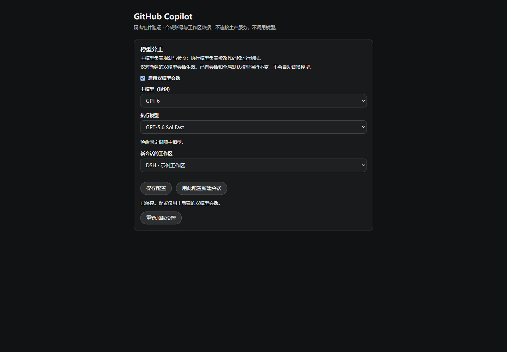
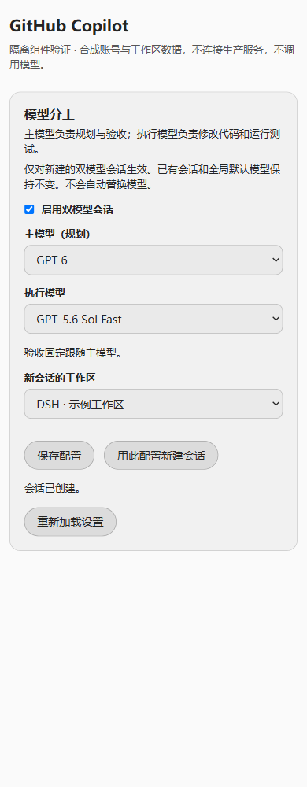

# Copilot model roles

Issue [#127](https://github.com/cloga/dsh-github-copilot/issues/127). This is an opt-in plugin feature, not a second model adapter, a replacement permission system, or a claim that the running Desktop has been upgraded.

## Use

1. Open **Settings → Models → Model roles** (Chinese: **模型分工**). Older supported Clients use the **Copilot · Model roles** settings section.
2. Enable dual-model sessions and select a **Planning model** and an **Execution model** from this account's available Copilot models. Model names and IDs come from the existing account-discovery service, never an implementation table.
3. Save the profile-global configuration; no workspace is required. The revision-checked save affects only this plugin's `github-copilot-dual-model` namespace, not a per-workspace setting. No global model default, credential, other provider or existing session is changed.
4. Check the read-only current workspace under **New dedicated session**, then choose **Create session with this configuration**. There is no workspace dropdown. If no current workspace can be established, open one in the application first; the plugin never guesses the first or most recent workspace. Return to the application if the host's settings surface remains open, then enter the task in the new conversation.
5. The planner clarifies the task, reads evidence and performs acceptance review. `copilot_execute` creates a native continuable execution child using the captured execution route. Its result shows the actual delegated provider/model and child ID; acceptance of the prompt is not completion. The original `send_message`, `list_agents` and `interrupt_agent` capabilities continue the child and expose its status.

For example, if the account advertises them, choose GPT 6 for planning and GPT-5.6 Sol Fast for execution. These are examples, not hard-coded defaults or promises of account entitlement. Acceptance uses the planning model. Both roles share the existing Host-only Copilot OAuth lifecycle.

The ordinary **Subagent → Allow agents to choose models for subagents** setting is a different feature: it authorizes optional model selection, and omission can still inherit a parent model. This dedicated entry captures and enforces a fixed route for its execution children instead. It does not silently enable that global setting.

## Scope and safety

- Disabled by default. Saving an enabled configuration requires two currently available models; a saved unavailable ID is kept visibly unavailable rather than silently replaced.
- Only sessions created through this entry receive the role policy. Saving different defaults, disabling new dual-model sessions, or editing unrelated sessions does not rewrite an existing role policy. Forked histories are not silently enrolled as new dedicated roots.
- Planner write/shell and alternative delegation tools are unavailable in the dedicated flow. Executors receive an explicit implementation-tool allowlist and cannot recursively delegate through the normal agent tools. These are model-workflow controls, **not a malicious-code sandbox**: an authorized shell can itself execute programs. Core sandbox and approval enforcement remain the authority.
- No fallback model is selected on account/model failure. The existing native adapter continues to validate account proof and real model requests; merely seeing an ID or passing metadata validation is not proof of a successful model call.
- The new root carries a session-local initial model selection, not a global-default write. Do not use the ordinary model picker to change a dedicated role: a different effective route is rejected with `DUAL_MODEL_SELECTION_LOCKED`. Create a new dedicated session for another role pair. Core's ordinary picker remains user/Core-owned and can itself save a future global default; this plugin does not intercept or promise to prevent that separate user action.
- Role declarations are captured in an immutable, namespaced, ignorable seed event before publication, and replayed by a plugin-owned projection. The policy includes its exact root ID so an inherited fork seed cannot impersonate a new role owner. The ordinary model-selection event uses Core's published per-session format.
- The plugin must remain mounted to enforce and resume the dedicated policy. Removal/update disposes plugin-owned overlays and stops their active work; an ignorable extension is not an enduring security barrier after uninstall. Unsupported public service contracts disable this feature visibly without turning normal account sign-in into a hard dependency failure.

## Create, retry and recovery

The browser generates a request UUID and keeps the original workspace and settings revision after an uncertain create, even when the application's current workspace changes or the card remounts under the same Remote owner. It never automatically replays creation. A user retry reuses that identity; the Host derives the same session ID, checks the stored operation before mutable settings, and either returns the original session or reports a conflict. It does not create a second root to work around an unknown result. Workspace attachment and session flush use public APIs; partial creation remains explicit and recoverable.

After a confirmed save conflict, reload settings and review the current configuration. During an uncertain creation the original input is held until confirmation. Reloading the whole browser can lose its in-memory pending receipt; inspect the session list before issuing a fresh creation request. The same supplied request UUID remains idempotent on the Host across process restart.

## Alpha.25 descriptor and Remote compatibility

The candidate targets official `dsh-v0.1.6-alpha.2` at `ddefc45fbc7f8e46dd73185e68295696d1297887`, without changing the retained development pin `0.1.2-rc.1`. Strict Remote descriptors expose `create()` factories for alpha.2 and retain the legacy `schema` field for older Gateways. Both paths use the same strict parser; this is not a downgrade to `src-json` and does not change the `view`, `save` or `create` endpoint payloads.

Dedicated executor admission now reads native **`subagent/descriptor` v3** (continuable `spawn`, explicit `agentProvider` and `agentModel`, and the declared native fields). Native descriptors were **already v3 in rc.1**. The plugin's previous v1 expectation was a plugin/test bug, not an alpha.2 change from v1 to v3. The plugin role-policy version, native descriptor version, and whole-Session storage-format version are distinct contracts.

The plugin-owned projection cache advances to **`stateVersion: 2`**, forcing Core to refold the durable events rather than trust a stale cached admission result. Refolding is a read-derived cache rebuild, **not a history migration**. Unknown, v1, v2, malformed or conflicting child descriptors fail closed and cannot authorize an executor overlay; their stored histories remain unmodified. Do not edit a version number, synthesize a v3 descriptor, or call this a conversion. Review the existing child and its work, then explicitly create a **new child** through the dedicated planner if continuation is needed. Keep the original history for inspection; this does not authorize automatic replacement or replay.

The exact official-first review and retirement conditions are in [official-first alpha.2](./official-first-016-alpha2.md). Source markers, local rc.1-backed focused tests and fifteen scoped exact-source runtime tests passed across alpha.2 contracts (8), Remote (1) and Session-context (6) fixtures. Full local `pnpm verify` passed: 1373 Vitest tests with 2 expected skips, 176 tooling tests, typechecks, build and package smoke; pack/tarball verification passed. The scoped run uses a supplemental resolver with official TypeScript `6.0.3`, declared `mime-types@3.0.2` and `ws@8.21.0`, and shared Zod `^4.4.3`, without source/dependency patches. Broad frozen dependency installation remains blocked by `node-addon-require-builtin@0.1.6` returning HTTP 404 from the configured mirror; full official-root-helper and CI qualification remain pending. None of this establishes live Desktop or published-artifact compatibility.

## Loading and Remote troubleshooting

**Could not load model roles** is a failed Remote load, not an instruction to change global model defaults. A `githubCopilotDualModel/view` HTTP 404 means the Host did not expose the endpoint; Client descriptors alone cannot register Host methods. The Host uses the public `TypertRemoteService` binding and marks only `view`, `save` and `create` with `@Remote`. A source fix does not change an already running installation.

A successful view can still report `DUAL_MODEL_UNSUPPORTED` when optional public capabilities are missing. An off configuration alone does not disable the model selectors. Read-only settings, a missing revision, pending operations, unavailable models and unavailable workspaces retain their existing gates. Reload after an ordinary transient failure; do not repeatedly save or create sessions to diagnose an endpoint failure.

Loading a supported view performs non-forcing account discovery and may use the existing OAuth refresh/network lifecycle. It is not guaranteed to be a credential- or network-side-effect-free probe. Regression tests use isolated synthetic services instead of the live profile.

## UI verification captures

These historical captures show the actual built component with **synthetic** account/workspace responses, not the production Desktop. They predate the current-workspace change and still show the removed destination dropdown; use the current browser fixture for the updated layout. [Capture provenance and artifact hashes](./images/dual-model-provenance.json) identify the exact evidence.

## Native dropdown appearance

Model and search-provider selects and their options use the application's surface, primary/secondary text and border tokens. They do not infer the application theme from the operating system. Hosts without the tokens use paired system-color fallbacks. This is presentation only: changing theme does not save settings or replace selections.

After building, `node tests/browser/verify-native-selects.mjs --playwright-module /absolute/path/to/existing/playwright-core/index.mjs --channel msedge` runs optional isolated browser checks without installing a browser dependency. It checks computed option/control colors, synthetic contrast, theme switching without remount or writes, 375px layout and enabled-control system fallbacks. The fixtures supply theme tokens rather than global option styling, so fixture CSS cannot hide a missing component style. It also exercises English/Chinese workspace flows: save without a workspace, preserve drafts on destination changes, block unknown destinations, and retry the original uncertain creation after navigation. These run against the built card with synthetic props/Remote responses; mounted public-list wiring is covered separately by the integration tests.

Page screenshots do not necessarily contain the OS-owned expanded popup. Check the expanded native menu separately on the target browser, including unavailable/disabled entries and the selected highlight. The automated computed-style checks are not full Windows popup-painting or live Desktop acceptance evidence; historical captures above predate this appearance fix.

## Public integration and evidence

The feature reuses public settings, account discovery, scope, Agent creation, Session projection/persistence, workspace attachment, tool restrictions/guards and native continuable subagents. It does not access Core private registries, edit prototypes, patch deployed packages, copy grants, install another wire adapter or require a Core change.

Missing Host role capabilities yield an unavailable card. Missing Client navigation/list capabilities disable fresh dedicated-session creation, not profile-global configuration. The package's broad compatibility range covers its existing account/search features; it is **not** a promise that this optional flow works on every historical baseline.

Current workspace observation uses only the public `sessions.list` and `workspaces.list` snapshot/subscribe faces. On [exact official alpha.2](https://github.com/deepseek-ai/deepseek-harness/blob/ddefc45fbc7f8e46dd73185e68295696d1297887/packages/api/session-controller/src/client/sessions/service.ts), `SessionListState` no longer exposes `current`: the plugin reads the unique `byId` row with positive public `retainedBy.mainView` ownership, matching the source used by [Core's UI Session adapter](https://github.com/deepseek-ai/deepseek-harness/blob/ddefc45fbc7f8e46dd73185e68295696d1297887/packages/client/ui-session/src/client/index.ts). Retained legacy Clients expose `current` directly. Both paths require ready lists and unique workspace membership through `workspaceId` / `sessionIds`. Pending, unavailable or ambiguous selection is not a creation destination. The observer never retains a Session, opens history, reads private navigation state, or calls native new-session navigation. One Remote face per registration owner preserves unsaved edits and uncertain receipts while those lists update.

Regression evidence is separated deliberately:

- `dual-model-card.spec.ts`: real React DOM/jsdom interaction, bilingual copy, CAS, unavailable models, stale responses and uncertain-create receipt handling.
- `dual-model-ui.spec.ts`: optional Slot registration, fallback and cleanup.
- `current-workspace.spec.ts` / `dual-model-workspace-ui.spec.ts`: synthetic public legacy/current-target list shapes, real Cordis dependency tracing and React-mounted Slot callbacks, current-workspace changes without draft loss, optional-service lifetime, and uncertain request retention across navigation and surface remounts. These are not live Desktop navigation certification.
- `dual-model-remote.spec.ts` / `dual-model-gateway.spec.ts`: strict owned codecs and the actual installed Client Gateway with synthetic RPC. Older Client Gateways do not sanitize successful values or arbitrary nested error details; the Host builds bounded DTOs, and the UI renders only its diagnostic allowlist.
- `tests/scripts/dual-model-host-gateway.test.mjs`: postbuild Node tests drive the real public Host Connection Fetch handler and Gateway, bypassing Vitest's protocol stub. They cover endpoint exposure, unsupported capabilities, domain input validation, private-method refusal, disposal, and synthetic model/workspace view plus CAS save. SRC JSON fallback does not inherit the Client's strict descriptors; Host validation rejects malformed nested inputs.
- `dual-model-host.spec.ts`: actual Core Session/projection/scope/tool primitives combined with synthetic Agent, model, persistence and workspace edges. This is not a paid live model run or a full installed Desktop certification.
- `remote-codec.spec.ts` / `dual-model-projection.spec.ts`: strict factory/legacy-parser bridge, native v3 descriptor admission, cache version/refolding contract, and fail-closed malformed/unknown/v1/v2 histories without mutation.
- `tests/fixtures/alpha2-contracts-core.fixture.ts`: exact alpha.2 contract fixture run through `scripts/verify-tagged-core.mjs`; the narrow supplemental exact-source run passed, but full official-helper closure qualification remains pending as described above, not implied by local rc.1-backed tests.
- `tests/browser/serve-dual-model.mjs`: serves the actual built Client component on a separate loopback fixture using synthetic account/workspace responses. Run after `pnpm build`; the printed URL is explicitly **not** the production DSH GUI.

Publication, Desktop installation, runtime activation and successful real model calls remain separate checks. Never restart active sessions or claim the installed UI changed merely because the repository build passed.

## 中文摘要

在设置的「模型分工」卡中启用功能，选择主模型和执行模型，保存同一配置档案内通用的全局设置；保存不需要工作区。「新建专用会话」只读显示应用当前工作区，再点「用此配置新建会话」。没有当前工作区时请先打开工作区，不自动选第一个或最近的工作区，也不再提供独立工作区下拉框。主模型负责规划、读取证据和验收；执行子代理使用创建时固定的模型修改代码、运行测试。不是在同一会话里自动来回切换模型，也不是只靠提示词建议执行者换模型。

仅专用入口创建的新会话采用此策略；不修改已有会话、全局默认模型、登录凭据或原生 Subagent 授权开关。模型不可用时明确报错，不自动换模型。需要换角色模型时请另建会话，不要用普通模型选择器改专用角色。插件卸载后不再提供该策略保障；这是协作流程约束，不代替 Core 的沙箱或审批。

创建结果不明时重试同一请求，避免重复会话；不要凭下载、构建或合成测试成功就宣称已安装、已生效或真实模型调用成功。

Alpha.25 改为接受原生 `subagent/descriptor` v3；rc.1 已经是 v3，旧 v1 判断是插件错误，不是上游历史格式升级。插件 projection cache 的 `stateVersion: 2` 仅强制重新折叠事件，不转换历史。未知／v1／v2／无效 descriptor 均保守拒绝且保留原历史，须审核旧子代理的工作后显式新建子代理，不能改版本号伪造 v3。Remote 使用严格 `create()` factory，并为旧 Gateway 保留同 parser 的 `schema` bridge。十五个限定范围精确源码运行时测试已通过，覆盖 alpha.2 contracts 8、Remote 1、Session-context 6 三个文件（补充 resolver、官方 TypeScript `6.0.3`、声明的 `mime-types@3.0.2` 与 `ws@8.21.0`、共享 Zod `^4.4.3`，不修改源码或依赖制品）。完整本地 `pnpm verify` 通过：1373 个 Vitest 测试、2 个预期跳过、176 个 tooling 测试，以及类型检查、构建和 package smoke；pack/tarball 验证也通过。实际 Host Gateway 严格解析由显式测试局部 contribution 验证，不代表生产 factory 已自动注册；生产 source fallback 独立校验输入。完整 frozen 依赖安装仍被 mirror 的 `node-addon-require-builtin@0.1.6` HTTP 404 阻塞，完整 official-root-helper 验收待执行，CI 未执行。限定范围及本地 rc.1 定向测试通过不代表完整矩阵、live Desktop 或已发布制品兼容。
