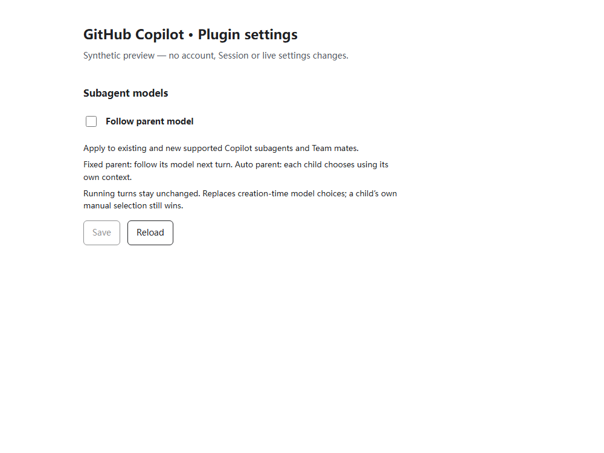

# One-switch parent model following

## Requirement and decision

Users change a master model and expect its subagents and Team mates to follow.
They must not manage Session IDs, bind each child, or visit a roster to enable
the same policy repeatedly. Alpha.66's explicit bindings were a technical
foundation, not an adequate ordinary user experience.

Add one **Follow parent model** switch to the existing plugin configuration
page, above the separate Web search section. Save once for the current DSH
profile. Default Off; no automatic migration or live profile changes on upgrade.

Enabling authorizes replacing supported children's creation-time route snapshots,
including snapshots that originally came from an explicit creation argument.
That provenance cannot be recovered from native descriptors. Child-owned
`model/selection` events, whether older or newly written, remain authoritative.
Turning the switch off/on never erases an explicit child selection.

## User-facing mockup

This is the intended settings layout, not a screenshot of a live account.



The image renders the actual component in an isolated browser fixture. It proves
layout only, not a live account, installed plugin or successful model transport.

```text
GitHub Copilot · Plugin settings

Subagent models
Follow parent model                                [ Off ]
Apply to existing and new supported subagents and Team mates.

Fixed parent model → children follow on their next turn.
Auto parent → each child chooses using its own context.
Running turns stay unchanged. A child's own manual selection wins.

[ Save ]  [ Reload ]

──────────────────────────────────────────────────────────
Web search
[ Existing search provider and fallback controls unchanged ]
```

On: the switch is checked, with the same short explanation. Unsaved change:
Save is enabled and status says "Unsaved change." Saving: controls disabled,
"Saving…" announced. Success: "Saved. Applies from each child's next turn."
Read-only/loading/failure states disable mutation rather than pretend to save.
An uncertain save requires Reload before retrying. No Session table, ID fields,
discovery action, model picker or account-login dependency belongs here.

The component inherits the page's system font, native controls and currentColor
theme. Labels wrap on narrow windows; all actions work with keyboard and have
visible native focus. There is no separate mobile composition or custom artwork.

## Technical plan

1. Add live boolean `github-copilot.followParentModel`, default false. Retain
   legacy `parentModelFollow` bindings unchanged, hidden from ordinary settings.
   Off disables the broad policy; existing explicit bindings remain active.
   If bindings exist, show a short read-only compatibility notice rather than
   falsely promise that Off disables them.
2. Extend the existing Host projection/resolver. Use actual `parentSession`
   lineage and supported v3 spawn descriptors, not model-ID matching or global
   defaults. Roots, fork descriptors, dedicated historical policies and
   non-Copilot parents stay native under the broad policy. Missing eligible
   parent evidence fails with a named diagnostic. Explicit bindings keep their
   existing stricter diagnostics.
3. Capture policy at the first assembly of a child turn. Preserve the same
   selection for subsequent steps/retries, including changes to the switch.
   Activation after an admitted step defers until the next turn. Follow exact
   Auto preference through verified nested lineage, resolving per-child context.
   No new history events, descriptor changes, session.selectModel calls,
   credentials/default writes or Core implementation changes.
4. Add one Client component using existing public Settings Remote describe and
   path-level CAS mutation of `['followParentModel']`. Before saving, read the
   current namespace: permit unrelated revision changes only if this leaf is
   unchanged. Never blindly retry a conflict. A successful policy save passes
   its exact previous/next revisions to the mounted search card; advance only
   matching revision evidence without discarding unsaved search drafts.
5. Add pure policy, Host turn-boundary, configuration, Client state/CAS and
   unchanged native AgentLoop regressions. Visually inspect the actual component
   at desktop/narrow widths using synthetic settings only.
6. Run required Windows/Linux CI, package gates, reviewed merge and verified
   GitHub/npm publication. Installation/restart is a separate user-authorized task.

## Scope and evidence

This is a profile-wide policy for supported native children whose effective
parent route is `github-copilot-preview`; it is not cross-provider routing.
Native Team creation labels are not rewritten. Current public APIs expose live
parents; an unavailable cold parent cannot supply a guessed selection.
Disabling broad following returns to native persisted routing on a later turn,
not restoration of an old creation snapshot. Strict histories remain unchanged.

The one-switch policy supersedes the ordinary per-child enrollment experience
in [automatic model routing](automatic-model-routing.md); that document retains
the exact-source investigation and alpha.66 compatibility background.
